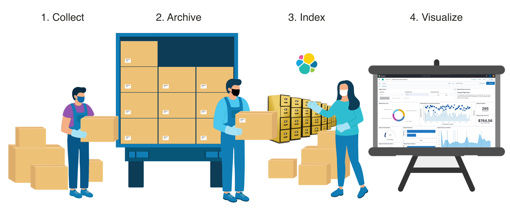
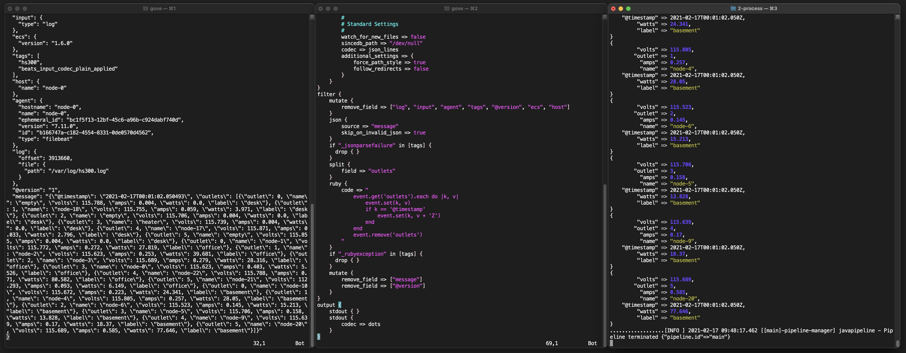
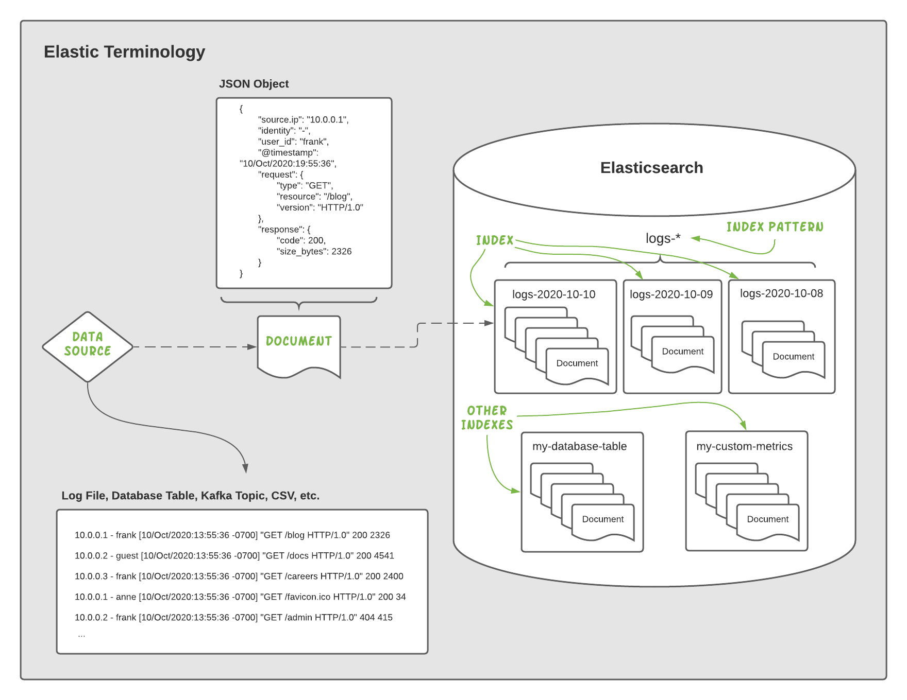
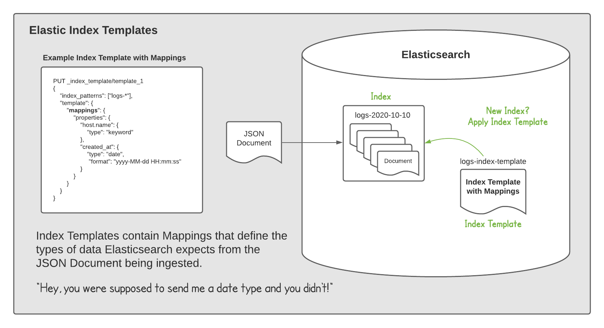
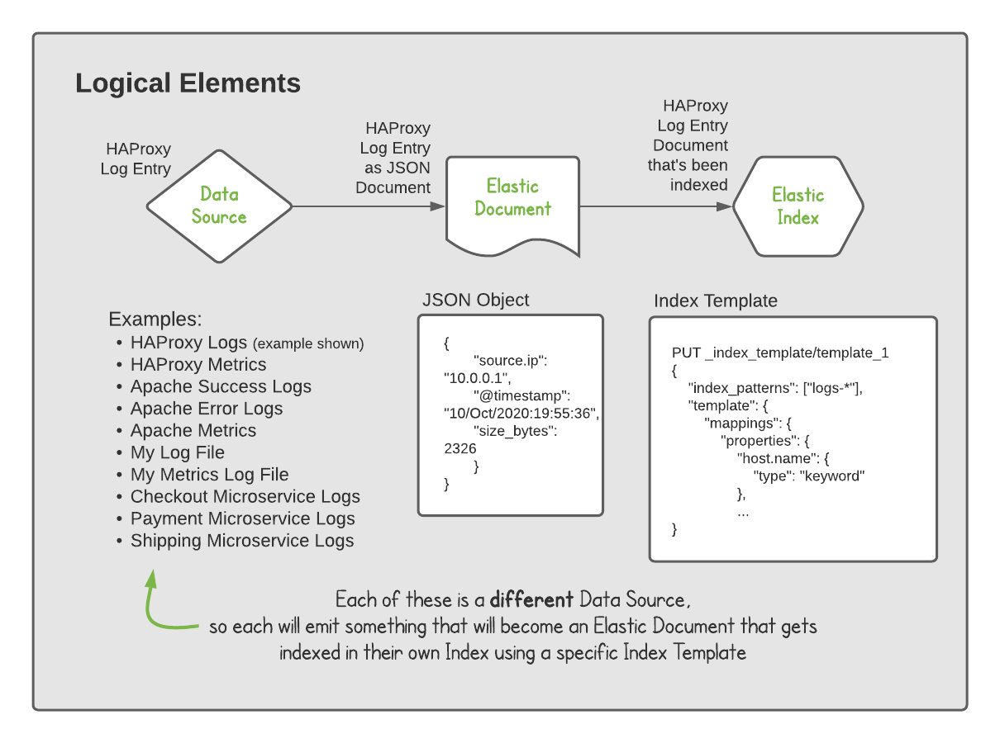

# Elastic Data Lake


The Elastic Data Lake is a framework for collecting & analyzing data using The Elastic Stack.  It lays out an opinionated architecture, data flow, concepts and more to guide users through some of the choices available when using Elastic.  Included is an architecture which describes the data flow through the stack.  You'll learn about The CAIV Method and how it simplifies the steps to onboard data.  Data flow patterns are discussed that allow you to re-index historical data with relative ease.  It presents ways to think about your data, best-practices to model your data, and an opportunity to share your work with the larger community.

## Table of Contents

1. [Architecture](#architecture)
2. [The CAIV Method](#the-caiv-method)
3. [Data Sources](#data-sources)
4. [Conventions](#conventions)
5. [Reindexing](#reindexing)
6. [Data Modeling](#data-modeling)
7. [Logstash Toolkit](#logstash-toolkit)
8. [Thinking in Elastic](#thinking-in-elastic)

## Architecture

This framework uses the following architecture for data flow.  Data is sent to Logstash which sends a copy of it to *both* Elasticsearch and your Data Lake, in parallel.  The Data Lake provides cheap, long-term durable storage for your raw data, while Elastic provides a cost-effective, indexed data store to search & analyze your data.


The framework encourages metering with a proxy at key points in the data flow.  This provides insight into your ingestion volume at the point of entry, into the Data Lake, and into Elastic.  These measurements are often used to gauge the volume of data the system is handling.

Many teams will use a message queue like Kafka in their architectures, in addition to Logstash.  This is perfectly suitable to add to this data flow, if you require it.  If you don't already have a message broker though, you may not need one.  Logstash alone can be used for moving your data around, in terms of parsing it and getting it to various systems for 3rd parties to access to it.

The [Setup](setup/README.md) guide provides instructions on setting up your Data Lake architecture.

## The CAIV Method

The CAIV Method outlines four distinct steps to collect & analyze your data.  When a step is complete, you will have added a layer of value to a particular data flow.  After completing all four steps, you're ready to start understanding the data you're collecting at a higher level.



If you build assets for a data source, we encourage you to contribute back to the community via the [Contribution](#contribute) section below.

### Step 1 - Collect Data

<small>No Elastic skills required</small>

The first step towards understanding something better, is to collect data on it.  Often times this means logging messages to a log file, but it could also mean storing data in a database, behind an API, or on a message queue.  The important part is that data is being produced that's important enough to track, and you can access it.  For many data sources like system log files, this step will be already done!  For others, it might require getting permission to read the data or even developing a program to generate the data.  Success at this step means you're ready to hand it to the person in charge of Step #2, where they will archive it.

### Step 2 - Archive Data

<small>Beats & Logstash skills required</small>

Archiving data is commonly needed for long-term retention, compliance, and disaster recovery.  We need to copy the data off of the source system generating it and into a cheap, long-term, durable datastore (aka Data Lake).  This step involves reading the data from the source system, shipping it to Logstash, and then having Logstash land it in your Data Lake.  We have Elastic Beats and Logstash which both have a wide range of ways to get at data, wherever it sits.  You shouldn't need to ask the owner of the data to change anything.  Both Logstash & Beats should allow us to passively collect the data and get it archived.

### Step 3 - Index Data

<small>Elasticsearch & Logstash skills required</small>

Indexing your data is a critical step in being able to ask questions about your data.  In this step, we'll mirror the incoming data headed to the Data Lake and send another copy to Elasticsearch.  We'll make sure the index is detecting our data correctly so we can build the right visualizations on top of it.  Often times, we'll use the [Logstash Toolkit](#logstash-toolkit) to improve the data model of the data coming in for a specific data source.  Doing so tees the owner of the next step up nicely.  An [Elastic Cluster](https://www.elastic.co/cloud) is needed for this step.

### Step 4 - Visualize Data

<small>Kibana skills required</small>

Visualizing your data in Kibana, Elastic's UI, is where the insight, information, and answers come out.  It's where you can interrogate your data, get answers, and then form new questions to ask.  Rinse and repeat and you have a powerful search engine that you can use to turn out insight after insight from your data.  Producing these visualizations will allow us to level-up our understanding of the data.

Below is a summary of The Cave Method:


## Data Sources

This guide takes an opinionated approach about how to lay out your data flows.  One tenant of this is that each "data source" will get its own end-to-end data flow.  A data source is defined as:

> **definition: Data Source** &mdash; A system or service producing data in a particular format.  The format might be unstructured text in a log file, metrics polled from an API, or business data in CSV format.  The format generally doesn't change over time.  A service could produce multiple data sources (e.g., NGINX has real-time metrics that can be polled and it emits multiple log files;  each of these are different data sources).

The data sources you wish to collect may already have assets in [/data-sources](/data-sources).  If they exist, that's great, you have a nice starting point.  If they aren't, this guide will walk you through creating them.  In general, a data source could also have variations as different needs come into play.

Below is an example of the variations assets can have for a given data source:


For example, let's say you want to collect & analyze logs from the popular HAProxy service.  There are a few ways to do this and the diagram demonstrates your choices.  You could use the official Elastic module provided in Filebeat.  Or maybe you're running an older version of HAProxy and need to roll your own.  Your first step is to check the [/data-sources](/data-sources) directory.  We want to see if anyone has already done the work and shared what you're trying to do, or if someone has come close.  If so, great, you can try out their work to see if it suits your needs.  If not, you can follow the steps in this guide to collect & parse HAProxy logs to meet your needs.

Generally, the assets for each data source follow a particular naming convention.  The goal here is to make it clear what piece is involved in touching a particular data flow.  This naming convention will help you know what data source is being collected, what Logstash Pipeline is processing it, what Index Template is indexing it, what Elasticsearch Index it's stored in, what Data Lake directory it's archived in, and what Elastic Dashboard visualizes it.

To create a Data Source, first read [Structure Your Data](structure-your-data.md), then follow these steps:

1. Copy the template directory to a directory named after your data source (e.g., my-custom-data):

	```
	$ cp -r data-sources/template data-sources/my-custom-data
	```

2. Edit the README.md, filling in each section with the information required for that step:

	* Title
	* Step #1 - Collect Data
	* Step #2 - Parse Data
	* Step #3 - Index Data
	* Step #4 - Visualize Data

3. Add any assets:

	```
	my-script.py
	pipeline-archive.yml
	pipeline-index.yml
	index-template.yml
	dashboard.ndjson
	```

4. Open an Issue or submit a Pull Request to have your data source added to this repo.

## Conventions

The Elastic Data Lake framework promotes convention over configuration.  The primitive most commonly used in this framework is a "data source" (aka "source type").  Data Sources are named after what is generating a particular type of data.  For example, Apache logs or NGINX logs, are examples of data sources.  This is the first important convention to remember as it will influence *where* we put the data.

One important distinction in the example above regarding "Apache logs" or "NGINX logs" is that the data source in these examples is specifically talking about just the log files these popular services emit.  The metrics that can be polled from these services are considered a different data source under this framework since they would have their own mapping (aka, schema) in Elasticsearch.  Elastic Common Schema (ECS) helps us tie these two data sources together by bringing convention to naming the similar fields they share.  For example, if we wanted to query both data sources for information on HTTP Status Codes, we would use the ECS field `http.response.status_code` to correlate data between the data sources, all on the same Dashboard in Elastic.

### Index Names

Data is indexed in indices named after the *data source*, followed by the day the event was created:

```
<data-source>-<YYYY-MM-dd>
```

This breaks from many implementations of Elastic that tend to put data collected from Filebeat in an index prefaced with `filebeat-*` or `filebeat-0000001`.  Because indices are laid out by *data source*, the `YYYY-MM-dd` convention will generally keep large shards that are over 50 GB from occuring.  

If you have a large, shared environment like PCF or K8S, this framework prefers to store the log files from each service deployed on those platforms in separate indices.  Logstash can do the heavy lifting of separating data sources from a log stream coming off these platforms.  But other than running in a shared environment, the data sources will often have different schemas and so putting them all in one index could lead to "wide records" in Elasticsearch.  Wide records or "field explosion" is when one document has thousands of possible fields.  Often times, this also means they're sparsely populated.

The principle of separate indices per data source also applies to Windows logs.  [Winlogbeat](https://www.elastic.co/beats/winlogbeat) specliazes in the collection of these logs and naming the fields in [ECS](https://www.elastic.co/what-is/ecs) format.  By default, it will store events in an index named `winlogbeat-<version>-yyyy.MM.dd`.  For large Windows environments producing > 50 GB / day of Windows Event Logs, it's encouraged to use Logstash to break out the logs by [Event Source](https://docs.microsoft.com/en-us/windows/win32/eventlog/event-sources).

In general, even for data sources that produce a few MB per day, we're generating a couple of shards per day (1 primary, 1 replica).  There is a case where "over sharding" (i.e., lots of small shards) can negatively impact the performance of an Elastic cluster.  We'll keep an eye out for this scenario but we shouldn't prematurely optimize for it.  The first goal, is creating a system that is easy to understand and rationalize about.

### Archive Names

The long-term archival of the data we're collecting will have the following folder structure.  Each data source has its own directory and data collected for that data source is stored in a subdirectory named after the date it was collected.  This gives us a clean way of seeing what data we collected and when.

```
<data-source-name>:
<day-of-year>/<hour-minute>/	<day-of-year>/<hour-minute>/		<day-of-year>/<hour-minute>/
```

For example:

```
NEEDS_CLASSIFIED:
2020-12-29/00-00		2020-12-29/00-01		2020-12-29/00-02

authlog:
2020-12-29/00-00		2020-12-29/00-01		2020-12-29/00-02

haproxy:
2020-12-29/00-00		2020-12-29/00-01		2020-12-29/00-02

my-custom-log:
2020-12-29/00-00		2020-12-29/00-01		2020-12-29/00-02

product-catalog:
2020-12-29/00-00		2020-12-29/01-00		2020-12-29/02-00

syslog:
2020-12-29/00-00		2020-12-29/00-01		2020-12-29/00-02

wikipedia:
2020-12-29/00-00		2020-12-30/00-00		2020-12-31/00-00
```

Data Sources can be archived at different intervals, with the default being once per minute.  You can adjust this layout structure by modifying the archive pipelines accordingly.

## Reindexing Data

Reindexing data is a core behavior of this framework.  Having the ability to reindex arbitrary sets of your data requires your cluster to have the necessary capacity to index the data.  If a cluster only has enough capacity to index "live" data, then sending in a large reindex job will slow it down tremendously.  Therefore, this framework requires you keep enough capacity in the cluster to handle the reindexing behavior of your needs.

Finding the right size of capacity is an exercise in understanding when, where, and how much reindexing you'll be doing.  For example, how fast does the reindex need to happen?  How large is the data set being reindexed?  Is the reindex occuring during peak cluster ingest periods or off hours?  Answers to these questions will guide you towards a cluster size that can sustain your reindexing behaviors.

The bottom line is, a cluster needs capacity to reindex data.  Being able to freely reindex data sets as needed comes with understanding whether capacity will be available.  It is incredibly valuable to have a workflow that allows you to reindex data as needed.  By keeping a fluid notion of indexes in Elastic, we can be more agile with regards to how we think about our data.  Ultimately, it frees us to choose when and where to put our data to receive the benefits offered by the datastore, be it a simple object store or an Elasticsearch store.

## Data Modeling

In general, there are two ways to store your data in Elastic:

1. Just dump it all in
2. Select what goes in

You can store all your data using the default settings, and get some great value with relatively minimal work.  Or, you can store just the important parts in your data, and take advantage of some additional benefits.  Both methods have pros and cons, but this guide focuses more on the second method.

Elastic is a search engine.  It's optimized to help you find information in large sets of data.  It does this by *indexing* the data you send it.  If you wanted to find information in a large book, you would turn to the *index* to see *where* in the book certain keywords are mentioned.  When you send data into Elastic, the data is indexed in a similar manner so users can quickly search large corpuses of data.

Understanding how index-based datastores work will help you when it comes to putting your data into them.  Occassionally, users ask why doesn't Elastic do joins?  Or provide query-time structuring of data?  It's not so much that Elastic doesn't provide those behaviors, it does, it just doesn't provide them in the traditional way.  Joins, for example, happen at ingest.  Since Elastic is optimized for information retrieval, it's not designed to store data in a first-order, normalized form like a database, as that takes time to resolve or dereference during each query.  The same goes for query-time structuring.  If we want to make information retrieval *fast*, we want an architecture that makes those trade-offs and optimizes for them (i.e., low-latency search for a better user experience).  Elastic does let you structure at query-time with [scripted fields](https://www.elastic.co/guide/en/kibana/current/scripted-fields.html) and [runtime fields](https://www.elastic.co/guide/en/elasticsearch/reference/current/runtime.html), but be aware of the trade-offs they introduce.

Once we're thinking about structuring data before sending it to Elasticsearch to index it, it's time to think about how to structure it.  You have a few options:

* [Logstash filters](https://www.elastic.co/guide/en/logstash/current/filter-plugins.html)
* [Ingest node pipelines](https://www.elastic.co/guide/en/elasticsearch/reference/current/ingest.html)
* [Beats processors](https://www.elastic.co/guide/en/beats/filebeat/current/defining-processors.html)
* 3rd party ETL tools
* Custom scripts

Options are good, and you have many, but we're going to focus on using Logstash filters in this guide.  Logstash filters are a mature way to structure data and provide a relatively simple, yet scalable, toolchain to handle millions of events per second.  Your requirements might sway you to another method of structuring your data, and that's perfectly fine.

### Dynamic or Explicit Modeling

You can either let Elastic *interpret* the type of data you're sending in (called [Dynamic mapping](https://www.elastic.co/guide/en/elasticsearch/reference/current/mapping.html#mapping-dynamic)) or you can tell Elastic *explicitly* what type of data you're sending in (called [Explicit mapping](https://www.elastic.co/guide/en/elasticsearch/reference/current/mapping.html#mapping-explicit)).  The best-practice here is to see how much we can let Elastic dynamically map, and only if necessary, go in and create some custom mappings if Elastic needs help.  Overall, we're being selective with regards to what we send Elasticsearch.  This will help:

* Keep your cluster size "lean"
* Improve your cluster's performance
* Provide the best user query experience

Hand-picking what data we index in Elasticsearch does take extra time (than just dumping everything in), but we feel it's worth it.  Often times, for clusters just indexing everything, you'll find that your logs end up being treated more like garbage than useful data.  We're not collecting data for the sake of collecting data, but if you take a lazy approach toward ingesting it, you'll get less out of understanding the data that was deemed "worth collecting" in the first place.

The goal of structuring data is to align it to a [Mapping](https://www.elastic.co/guide/en/elasticsearch/reference/current/mapping.html) contained in an [Index Template](), for a given data source.  If you are familiar with building tables in traditional SQL databases, you can think of Mappings and Index Templates as a database schema for a table.  They define what *type* of data to expect.  Leveraging both Elastic's ability to dynamically map (or detect) field types with the ability to provide explicit field types only as necessary, will help Elasticsearch store your data in the optimal data structures on disk and in memory, and know how to responsd to user queries with fast and efficient retrieval.

The ELK Stack uses a "[Schema on Write](https://www.elastic.co/blog/schema-on-write-vs-schema-on-read)" architecture compared to a "Schema on Read" architecture.  Since data is more often queried than it is written (usually, way more), we only want to parse the data once, and not pay the computational cost of structuring it on the fly each time a user queries it.  Doing so gives Elastic the optimal approach for fast, efficient retrieval when a user queries it.

## Logstash Toolkit

Logstash processes data using pipelines.  Logstash pipelines can be built a number of ways.  Below is one method for iteratively building them.  It's outlined in 3 steps:

1. Print events to `stdout` to verify we can read them
2. Add a [Logstash Filter](https://www.elastic.co/guide/en/logstash/current/filter-plugins.html) to the `filter` block to modify the structure
3. Repeat Step #2 until your records are structured

The goal is to build a series of filters inside the `filter` block, which will turn the unstructured or semi-structured data into a structured format.

One approach to following these steps is to setup three terminals, side-by-side, and open the following in each:

* Terminal 1 - Source record that we'll use to reference existing structure
* Terminal 2 - Our Logstash pipeline so we can slowly add `filters`
* Terminal 3 - Shell to run Logstash which will reflect the new structure after being filtered



In the above example, you can see the raw record on the left, the filter chain in the middle, and the structured output on the right.  Building a `filter` chain in Logstash is largely an exercise in referencing the [Logstash Filters](https://www.elastic.co/guide/en/logstash/current/filter-plugins.html) documentation to see what is available, how they behave, and options they take.

Start with an empty filter chain:

```
filter {
}
```

Verify that the `stdout` output plugin is able to print records to `stdout` without any filtering.  Then add your first filter:

```
filter {
    add_field => {
    	"foo" => "bar"
    }
}
```

When you save the `test.yml` file, Logstash will pick up the change and re-run the filters in the file.  This should give you an "iteration loop" to run over and over as you build your `filter` chain.

Logstash has the ability to [add conditionals and use variables](https://www.elastic.co/guide/en/logstash/current/event-dependent-configuration.html).  Once you become familiar with the syntax, you'll find it quite powerful with regards to pulling apart data and structuring it the way you want it.

## Structure for Mappings

The goal of structuring our data is to align it to our [Mapping](https://www.elastic.co/guide/en/elasticsearch/reference/current/mapping.html), for a given data source.  If you are familiar with building tables in traditional SQL databases, then think of Mappings like database schemas.  They define what *type* of data an index will hold in Elasticsearch, or what *type* of data a table will hold in a SQL database.

The [Field data types](https://www.elastic.co/guide/en/elasticsearch/reference/current/mapping-types.html) supported by Elasticsearch are very similar to those you'd find when building a schema for a database.  The types help the datastore understand how to deal with the data your storing.  In the case of Elasticsearch, the types help tell the system how you intend to *retrieve* a given field.  Do you want to search it?  Then use the *analyzed* [text field type](https://www.elastic.co/guide/en/elasticsearch/reference/current/text.html).  Do you want to simply filter it?  Then use a type from the [keyword type family](https://www.elastic.co/guide/en/elasticsearch/reference/current/keyword.html).

## Index Template

The [Index Template](https://www.elastic.co/guide/en/elasticsearch/reference/current/index-templates.html) is where the Mappings are defined for a given Index in Elasticsearch.  An [Index](https://www.elastic.co/blog/what-is-an-elasticsearch-index) is what Elasticsearch uses to logically store your data.

# Thinking in Elastic

Let's briefly cover how to think about data while working with Elastic.  We'll briefly cover Elastic Terminology and then get into data modeling methodologies.  There's sometimes confusion or differences of opinion regarding a term, so we'll settle on the following definitions for our use here.

## Elastic Terminology

### General Terms

The high-level terms to be familiar with are:

| Term | Description |
| ----------- | ----------- |
| Elasticsearch | Distributed search & analytics engine |
| Logstash | ETL data collection & pipelining engine |
| Kibana | Web UI for Data Visualizaton and Elastic Stack management |
| Beats | Lightweight data shippers (e.g., Filebeat, Metricbeat, Winlogbeat, etc.) |
| The Elastic Stack | All of the components of Elastic:  Elasticsearch, Logstash, Kibana, Beats |
| The ELK Stack | See "The Elastic Stack" |
| Elastic       | Could refer to [Elastic.co](https://www.elastic.co) (the company that built the stack) or the stack itself |
| Elastic Cloud | Elastic's managed offering of the stack available at [cloud.elastic.co](https://cloud.elastic.co) |
| Self-Managed | When you [download](https://www.elastic.co/start) the stack, install, and run it yourself. |

### The Elastic Stack Terms

Elasticsearch is a distributed index, which revolves around the concept of a document.  This document is represented as a JSON Object when talking to Elasticsearch.  There's a great overview of the core concepts in Elastic's documentation, if you'd like to take a few minutes to review that before continuing:

[https://www.elastic.co/guide/en/elasticsearch/reference/current/documents-indices.html](https://www.elastic.co/guide/en/elasticsearch/reference/current/documents-indices.html)

We'll recap many of the key points below.  The terminology to remember is:

| Term | Definition |
| --------------------------------------- | ----------- |
| Data Source<br>(aka Source Type)                    | A source of data to be indexed with Elasticsearch.  Examples include, log files, polled metrics, SQL exports, CSV data, and more.  One service may emit several data sources (e.g., HAProxy has an endpoint to poll metrics, and it logs events to a file). |
| Archived Document                      | Often times it makes sense to store raw data in a Data Lake.  When we do that, the data might be changed slightly by having metadata added to it.  For example, what captured it, when, and so on.  The original raw data should be well preserved in this format, however. |
| Elastic Document                        | A JSON Object representing an event from your data source. The "event" could be a single log line, a set of polled metrics, a row from a SQL or CSV source, or more.  Elastic Documents can be enriched to include additional data (that might be needed when querying the index), as well as metadata that describes how the Data Source was collected. |
| Elastic Index                           | A place where the same type of Elastic Documents are indexed & queried. They allow users to query the data you've ingested to get quick results.  A set of documents is stored in one index, and that index may be replicated for resiliency & performance. |
| Elastic Index Pattern | A set of indexes that contain the same type of Elastic Documents.  Indexes can only get so big, before you should start storing documents in a new index.  An Index Pattern is used to query a set of indexes as if they were one index. |

These terms are displayed in the diagram below:



When you approach a data set that you want to index in Elasticsearch, think about it in terms of Elastic Documents.  Here are some questions to ask as you consider a data source or set of data to bring into Elasticsearch:

* What data will go in an Elastic Document?
* How many different kinds of Elastic Documents do we need?
* What questions do we want to answer from the documents?
* How many documents are we expecting to index?
* What's their average size and rate coming in?

From here, you can start to build a model of Elastic Documents you'll need to construct.  In most cases, one Elastic Document will translate to one line in a log file, or one line in a CSV or database table.  For many use-cases, there will be billions of documents stored in an index set inside Elasticsearch, so don't be scared of big numbers.  The average document size may only be a few KB, but can also get into the MB and even GB for certain use-cases.

#### Normaling Data

When you think about ingesting data into Elasticsearch, think about it in terms of "data objects".  What do you want to put in your data object.  We present our data objects to Elasticsearch as JSON objects.  JSON, or JavaScript Object Notation, is a way for us to codify the data we're talking about.  

These terms all mean the same thing:

* Data Object
* JSON Object
* Document
* JSON Document
* Record

Data sent into Elasticsearch, let's say a line in a log file, is going to be sent into Elasticsearch as a JSON document.  In it's raw form, that log line is just a string.  It may be semi-structured in that it's using a repeatable pattern, like the common Apache format:

```
127.0.0.1 - frank [10/Oct/2000:13:55:36 -0700] "GET /apache_pb.gif HTTP/1.0" 200 2326
```

This log line can be reliably deconstructed into:

* IP address of the client (127.0.0.1)
* The RFC 1413 identity of the client (- notes it's not available)
* The userid of the person requesting the document (frank)
* The time that the request was received
* The request line from the client
* The status code that the server sent back to the client
* The size of the object returned to the client, not including the response headers

This "structure" is not represented when the log file is in it's raw form, sitting on a log file on disk.  We have to apply the logical structure to this log file by pulling apart the log file and correctly typing each part of it.  The IP Address is a different type than the date, or the status code.  By typing each field correctly, we can more powerfully query the logs from this system.

If we just indexed this log line as a simple string, we wouldn't be able to ask these questions:

* How many requests came from that IP?
* How many of those requests returned a 200?
* What was the average response size of the requests?
* When did those requests occur?

By taking the time to structure that log line and map the each portion to the correct "type" in Elasticsearch, we can open up a powerful set of questions to be asked.  Without structuring the log line, a computer will have a hard time figuring out that `127.0.0.1` is an IP Address and should expect CIDR queries or that 200 is an integer and not a string, which means it should allow mathmatical operaitons on it.

In many cases, log lines like the one above are well known.  Meaning, these log lines rarely change and we can write parsers for them that add the structure we need.  In some cases, the log line or data we're sending into Elasticsearch may not be of a "known" format and we need to write the parsers that add the logical structure and correct typing ourselves.



Here's an example data object:

```
{
	"name": "Shay Banon",
	"projects" : ["elasticsearch", "logstash", "kibana", "beats"],
	"employees": 2000
}
```

## What, No Joins?

We may want to include more in our data object.  To do that, we'll join in some data to enrich our document:

```
{
	"name": "Shay Banon",
	"projects" : ["elasticsearch", "logstash", "kibana", "beats"],
	"employees": 2000,
	"bio": {
		"title": "CEO of Elastic B.V.",
		"twitter": "kimchy"
	}
}
```

You can join data into your document a number of ways, but the key is to do it before sending it into Elasticsearch for indexing.  As an index, Elasticsearch is focused on _information retrieval_, and responding as quickly as possible to your query.  To do that, it doesn't want to spend time denormalizing data or parsing unstructured data.  We want to do those processes _before_ sending data into Elasticsearch.

There are ways to perform these behaviors after the data has been indexed, but you'll be paying a computation cost each time the data is queried.  In typical work patterns, data is *read* way more than it is written. With that in mind, think about why then Elasticsearch is optimized for a user's experience querying their data.

In the example above, we're looking at a data object represented in JSON.  This "document" or "JSON object" represents the data we want to send into Elasticsearch.  Before we do that, we have a few decisions to make.



## Contribute

If you have a data source you've parsed, built a pipeline for, an index template, and a dashboard, you are welcome to share it with the community.  Please submit an issue with the assets or a pull request.