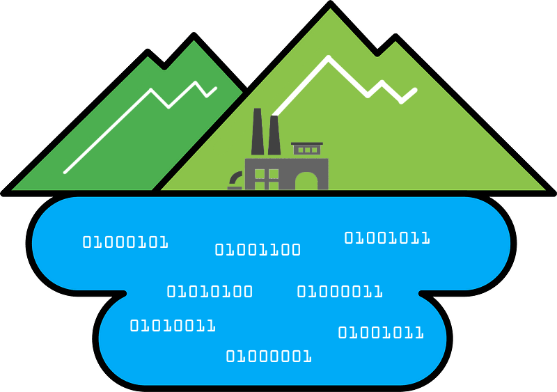
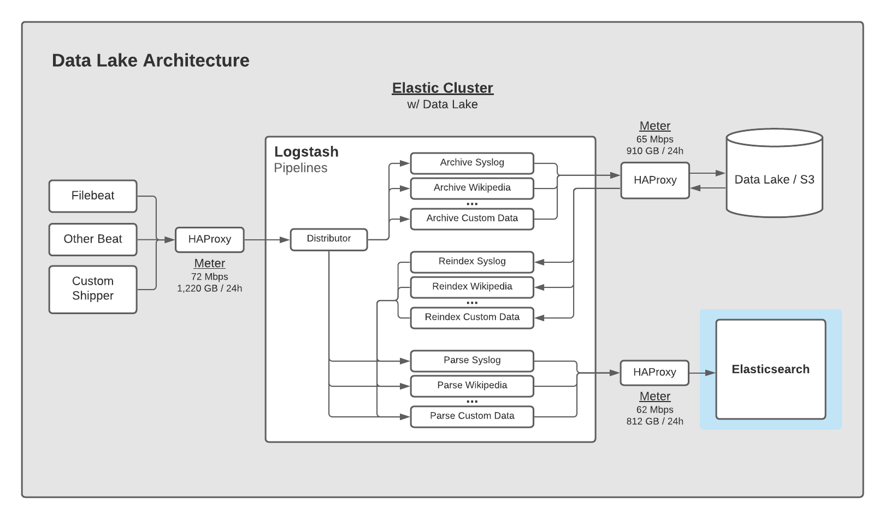
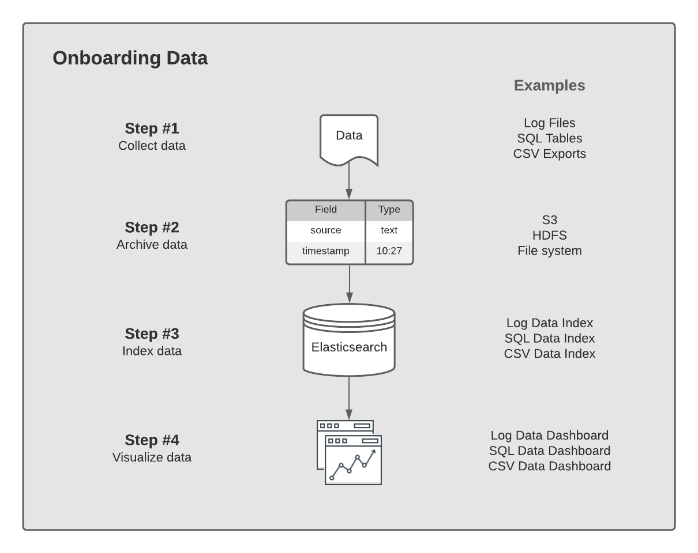
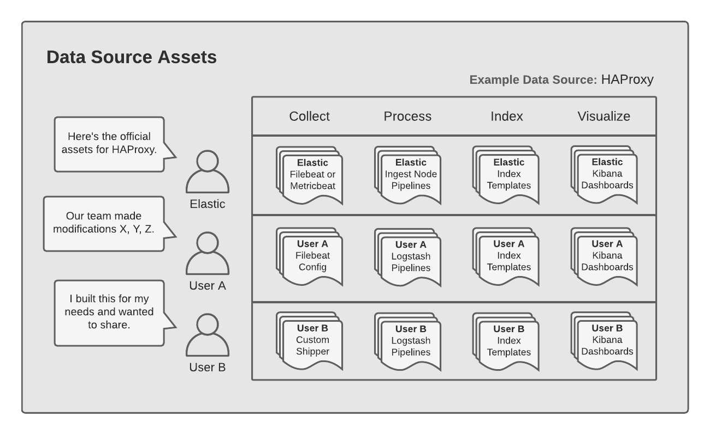

# Elastic Data Lake



The Elastic Data Lake is a guide for operating a data collection & analysis environment using the Elastic Stack.  It's a framework that supports both real-time and historical data flows, ranging from collecting and analyzing operations data to business data.  Though there are several ways to architect data flows with Elastic, this guide takes an opinionated approach to drive towards "convention over configuration".

This pattern uses the following architecture for data flow.  Logstash sends a copy of the data to both Elasticsearch and your Data Lake, in parallel.  The Data Lake provides cheap, long-term durable storage for your raw data, while Elastic provides a cost-effective, indexed data store to analyze your data.



The framework encourages metering with a proxy at key points in the data flow.  This provides insight into our ingestion volume at the point of entry, into the Data Lake, and into Elastic.  These measurements are often used to gauge the voluem of data the system is handling.

Many teams will use a message queue like Kafka in their architectures, in addition to Logstash.  This is perfectly suitable to add to this data flow, if you require it.  If you don't already have a message broker though, you may not need one.  Logstash can already do a lot of the heavy lifting of moving your data around, in terms of parsing it and getting it to various systems for 3rd parties to access to it.

The [Setup](/setup) guide provides instructions on setting up your Data Lake architecture.

## Data Sources

This guide takes an opinionated approach about how to lay out your data flows.  One tenant of this is that each "data source" will get its own end-to-end data flow.  A data source is defined as:

> **definition: Data Source** &mdash; A system or service producing data in a particular format.  The format might be unstructured text in a log file, metrics polled from an API, or business data in CSV format.  The format generally doesn't change over time.  A service could produce multiple data sources (e.g., NGINX has real-time metrics that can be polled and it emits multiple log files;  each of these are different data sources).

A given data source will have a series of assets to help collect and analyze it.  An example of a data source's assets and the overall onboarding process is below:



The data sources you wish to collect may already have assets in [/data-sources](/data-sources).  If they are, that's great, you have a nice starting point.  If they aren't, this guide will walk you through creating them.  In general, a data source could also have variations as different needs come into play.

Below is an example of the variations assets can have for a given data source:



For example, let's say you want to collect & analyze data (logs or metrics) from the popular HAProxy service.  There are a few ways to do that and this diagram demonstrates how.  You could use the official Elastic modules provided in Filebeat and Metricbeat.  Or maybe you're running an older version of HAProxy and need to roll your own.  You'd first check the [/data-sources](/data-sources) directory for any directories with the word "haproxy" in the name. We want to see if anyone has already done what you're trying to do, or if someone has come close.  If so, great, you can try out their work to see if it suits your needs.  If not, you can follow the steps in this guide to collect & parse HAProxy to meet your needs.

Generally, the assets for each data source follow a particular naming convention.  The goal here is to make it clear what piece is involved in touching a particular data flow.  This naming convention will help you know what data source is being collected, what Logstash Pipeline is processing it, what Index Template is indexing it, what Elasticsearch Index it's stored in, what Data Lake directory it's archived in, and what Elastic Dashboard visualizes it.

To create a Data Source, first read [Structuring Your Data](structuring-your-data.md), then follow these steps:

1. Copy the template directory to a directory named after your data source (e.g., my-custom-data):

	```
	$ cp -r data-sources/template data-sources/my-custom-data
	```

2. Edit the README.md, filling in each section with the information required for that step:

	* Title
	* Step #1 - Collect Data
	* Step #2 - Parse Data
	* Step #3 - Index Data
	* Step #4 - Visualize Data

3. Add any assets:

	```
	my-script.py
	pipeline-archive.yml
	pipeline-index.yml
	index-template.yml
	dashboard.ndjson
	```

4. Open an Issue or submit a Pull Request to have your data source added to this repo.

## Conventions

The Elastic Data Lake pattern promotes convention over configuration.  The primitive most commonly used in this framework is a "data source".  Data Sources are named after what is generating a particular type of data.  For example, Apache logs or NGINX logs, are examples of data sources.  This is the first important convention to remember as it will influence *where* we put your data.

One important distinction in the example above regarding "Apache logs" or "NGINX logs" is that the data source in these examples is specifically talking about just the log files these popular services emit.  The metrics that can be polled from these services are considered a different data source under this framework since they would have their own mapping (a.k.a. schema) in Elasticsearch.  Elastic Common Schema (ECS) helps us tie these two data sources together by bringing convention to naming similar fields they share.  For example, if we wanted to query both data sources for information on HTTP Status Codes, we would use the ECS field `http.response.status_code` to correlate data between the data sources.

### Index Names

Data is indexed in indices named after the *data source*, followed by the day the event was created:

```
<data-source>-<YYYY-MM-dd>
```

This breaks from many implementations of Elastic that tend to put data collected from Filebeat in an index prefaced with `filebeat-*` or `filebeat-0000001`.  Because indices are laid out by *data source*, the `YYYY-MM-dd` convention will generally keep large shards that are over 50 GB from occuring.  

If you have a large, shared environment like PCF or K8S, it's advised to store each service's log files in their own indices following this convention.  Logstash can do the heavy lifting of separating data sources from a log stream coming off these platforms.  But other than running in a shared environment, the data sources will often have different schemas and so putting them all in one index could lead to "wide records" in Elasticsearch.  Wide records or "field explosion" is when one document has thousands of possible fields.  Often times, this also means they're sparsely populated.

### Archive Names

The long-term archival of the data we're collecting will have the following folder structure.  Each data source has its own directory and data collected for that data source is stored in a subdirectory named after the date it was collected.  This gives us a clean way of seeing what data we collected and when.

```
<data-source-name>:
<day-of-year>/<hour-minute>/	<day-of-year>/<hour-minute>/		<day-of-year>/<hour-minute>/
```

For example:

```
NEEDS_CLASSIFIED:
2020-12-29/00-00		2020-12-29/00-01		2020-12-29/00-02

authlog:
2020-12-29/00-00		2020-12-29/00-01		2020-12-29/00-02

haproxy:
2020-12-29/00-00		2020-12-29/00-01		2020-12-29/00-02

my-custom-log:
2020-12-29/00-00		2020-12-29/00-01		2020-12-29/00-02

product-catalog:
2020-12-29/00-00		2020-12-29/01-00		2020-12-29/02-00

syslog:
2020-12-29/00-00		2020-12-29/00-01		2020-12-29/00-02

wikipedia:
2020-12-29/00-00		2020-12-30/00-00		2020-12-31/00-00
```

Data Sources can be archived at different intervals, with the default being once per minute.  You can adjust this layout structure by modifying the archive pipelines accordingly.

## Reindexing Data

Reindexing data is a core behavior of this framework.  Having the ability to reindex arbitrary sets of your data requires your cluster to have the necessary capacity to index the data.  If a cluster only has enough capacity to index "live" data, then sending in a large reindex job will slow it down tremendously.  Therefore, this framework requires you keep enough capacity in the cluster to handle the reindexing behavior of your needs.

Finding the right size of capacity is an exercise in understanding when, where, and how much reindexing you'll be doing.  For example, how fast does the reindex need to happen?  How large is the data set being reindexed?  Is the reindex occuring during peak cluster ingest periods or off hours?  Answers to these questions will guide you towards a cluster size that can sustain your reindexing behaviors.

The bottom line is, a cluster needs capacity to reindex data.  Being able to freely reindex data sets as needed comes with understanding whether capacity will be available.  It is incredibly valuable to have a workflow that allows you to reindex data as needed.  By keeping a fluid notion of indexes in Elastic, we can be more agile with regards to how we think about our data.  Ultimately, it frees us to choose when and where to put our data to receive the benefits offered by the datastore, be it a simple object store or an Elasticsearch store.

## Contribute

If you have a data source you've parsed, built a pipeline for, an index template, and a dashboard, you are welcome to share it with the community.  Please submit an issue with the assets or a pull request.

<style>
table {
    width:100%;
}
</style>