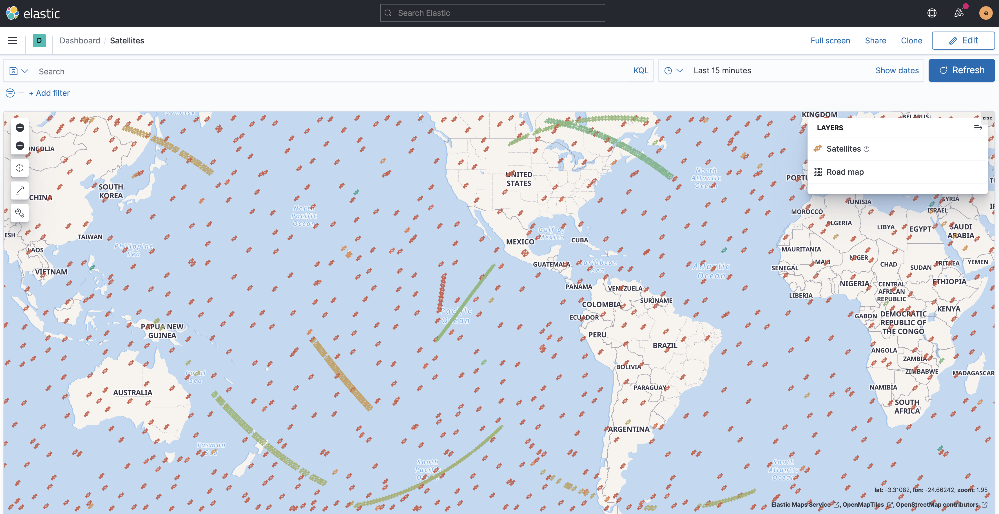

# Tracking Satellites with Elastic


Often times data we collect will include geospatial information which is worth seeing on a map.  [Elastic Maps](https://www.elastic.co/maps) is a great way to visualize this data to better understand how it is behaving.  [The Elastic Stack](https://www.elastic.co/what-is/elk-stack) supports a wide range of [Field data types](https://www.elastic.co/guide/en/elasticsearch/reference/current/mapping-types.html) that include [geo points](https://www.elastic.co/guide/en/elasticsearch/reference/current/geo-point.html).  For this data source, we track the location of over 1,000 [Starlink](https://en.wikipedia.org/wiki/Starlink) satellites and the [International Space Station](https://en.wikipedia.org/wiki/International_Space_Station) (ISS).

Plotting the location of these satellites involves getting the latest [TLE](https://en.wikipedia.org/wiki/Two-line_element_set) from [Celestrak](http://www.celestrak.com/Norad/elements/table.php?tleFile=starlink&title=Starlink%20Satellites&orbits=0&pointsPerRev=90&frame=1), then using the [Skyfield API](https://rhodesmill.org/skyfield/) to convert the TLE to a Latitude & Longitude by providing a time and date.

## Step #1 - Collect Data

Install the following Python module that knows how to convert TLE information into latitude & longitude:

```bash
$ pip3 install skyfield
```

Create a new python script with the following contents:

​	[1-collect/satellites.py](1-collect/satellites.py)

Create a new bash script with the following contents:

​	[1-collect/satellites.sh](1-collect/satellites.sh)

You can store these wherever you'd like.  A good place to put them is in a `~/python` and `~/bin` directory, respectively.

Try running the Python script directly:

```
$ chmod a+x ~/python/satellites/satellites.py
$ ~/python/satellites/satellites.py
```

You should see output similar to:

```json
{"@timestamp": "2021-04-18T16:47:54Z", "satellites": [{"name": "ISS", "sat_num": 25544, "location": {"lat": -9.499628732834388, "lon": 5.524255661695312}, "elevation": 421272}, {"name": "STARLINK-24", "sat_num": 44238, "location": {"lat": -53.0987009533634, "lon": 75.21545552082654}, "elevation": 539139}]}
```

Once you confirm the script is working, you can redirect its output to a log file:

```
$ sudo touch /var/log/satellites.log
$ sudo chown ubuntu.ubuntu /var/log/satellites.log
```

Create a logrotate entry so the log file doesn't grow unbounded:

```
$ sudo vi /etc/logrotate.d/satellites
```

Add the following content:

```
/var/log/satellites.log {
  weekly
  rotate 12
  compress
  delaycompress
  missingok
  notifempty
  create 644 ubuntu ubuntu
}
```

Add the following entry to your crontab:

```
* * * * * /home/ubuntu/bin/satellites.sh > /dev/null 2>&1
```

Verify output by tailing the log file for a few minutes:

```
$ tail -f /var/log/satellites.log
```

Tell Filebeat to send events in it to Elasticsearch, by editing `/etc/filebeat/filebeat.yml`:

```
filebeat.inputs:
- type: log
  enabled: true
  tags: ["satellites"]
  paths:
    - /var/log/satellites.log
```

Restart Filebeat:

```
$ sudo systemctl restart filebeat
```

We now have a reliable collection method that will queue the satellite data on disk to a log file.  Next, we'll leverage Filebeat to manage all the domain-specific logic of handing it off to Logstash in a reliable manner, dealing with retries, backoff logic, and more.

## Step #2 - Archive Data

Once you have a data source that's ready to archive, we'll turn to Filebeat to send in the data to Logstash.  By default, our `distributor` pipeline will put any unrecognized data in a Data Lake bucket called `NEEDS_CLASSIFIED`.  To change this, we're going to update the `distributor` pipeline to recognize the satellites data feed and create two pipelines that know how to archive it in the Data Lake.

If you're doing this in environment with multiple Logstash instances, please adapt the instruction below to your workflow for deploying updates.  Ansible is a great configuration management tool for this purpose.

## Step #3 - Index Data

Once Logstash is archiving the data, we need to index it with Elastic.

## Step #4 - Visualize Data

Once Elasticsearch is indexing the data, we want to visualize it in Kibana.

