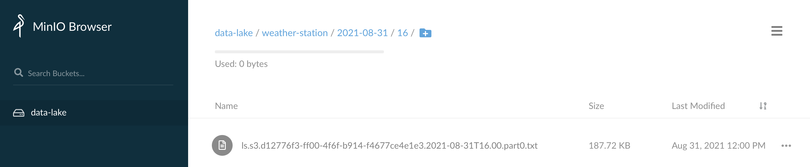

# Monitoring Weather with Elastic


The [WS-1550-IP](https://ambientweather.com/amws1500.html) from Ambient Weather is a great amatuer weather station.  The station itself is powered by solar with AA battery backup, it's relatively maintenance free, and it's a joy to observe in action.  It communicates with a base station via 915 MHz that requires no setup.  You can also add up to 8 additional sensors to collect temperature from various points within range, all wirelessly.  The base station connects to the Internet via a hard-wired RJ-45 connection on your network, that it uses to upload the data it collects to Ambient Weather's free service.  From there, you can query an [API](https://ambientweather.docs.apiary.io/#) to get your latest, hyper-local, weather.

## Step #1 - Collect Data

Create a new python script called `~/bin/weather-station.py` with the following contents:

```python
#!/usr/bin/env python3
  
import urllib.request
import urllib.parse

api_key = '<your_api_key>'
app_key = '<your_app_key>'

url = "https://api.ambientweather.net/v1/devices?apiKey=%s&applicationKey=%s" % (api_key, app_key)

try:
    f = urllib.request.urlopen(url)
except urllib.error.HTTPError as e:
    # Return code error (e.g. 404, 501, ...)
    print('[{"lastData": {"http_code": %s}}]' % (e.code))
except urllib.error.URLError as e:
    # Not an HTTP-specific error (e.g. connection refused)
    print('[{"lastData": {"http_error": "%s"}}]' % (e.reason))
else:
    # 200
    print(f.read().decode("utf-8"))
```

Enter your API key and Application key from the Ambient Weather service.

This script queries the Ambient Weather API using your API key and Application key.  It then prints the response to `stdout`.  Once we've confirmed the script works, we'll redirect `stdout` to a log file.

Try running the script:

```bash
chmod a+x ~/bin/weather-station.py
~/bin/weather-station.py
```

You should see output similar to:

```json
[{"macAddress":"00:0E:C6:20:0F:7B","lastData":{"dateutc":1630076460000,"winddir":186,"windspeedmph":0.22,"windgustmph":1.12,"maxdailygust":4.47,"tempf":82.4,"battout":1,"humidity":69,"hourlyrainin":0,"eventrainin":0,"dailyrainin":0,"weeklyrainin":1.22,"monthlyrainin":5.03,"yearlyrainin":21.34,"totalrainin":21.34,"tempinf":73.4,"battin":1,"humidityin":62, ...
```

Once you confirm the script is working, you can redirect its output to a log file:

```bash
sudo touch /var/log/weather-station.log
sudo chown ubuntu.ubuntu /var/log/weather-station.log
```

Create a logrotate entry so the log file doesn't grow unbounded:

```bash
sudo vi /etc/logrotate.d/weather-station
```

Add the following logrotate content:

```
/var/log/weather-station.log {
  weekly
  rotate 12
  compress
  delaycompress
  missingok
  notifempty
  create 644 ubuntu ubuntu
}
```

Add the following entry to your crontab with `crontab -e`:

```
* * * * * /home/ubuntu/bin/weather-station.py >> /var/log/weather-station.log 2>&1
```

Verify output by tailing the log file for a few minutes (since cron is only running the script at the start of each minute):

```bash
tail -f /var/log/weather-station.log
```

If you're seeing output scroll each minute then you are successfully collecting data!

## Step #2 - Archive Data

Once your data is ready to archive, we'll use Filebeat to send it to Logstash which will in turn sends it to S3.

Add the following to the Filebeat config `/etc/filebeat/filebeat.yml` on the host logging your weather data:

```yaml
filebeat.inputs:
- type: log
  enabled: true
  tags: ["weather-station"]
  paths:
    - /var/log/weather-station.log
```

This tells Filebeat where the log file is located and it adds a tag to each event.  We'll refer to that tag in Logstash so we can easily isolate events from this data stream.

Restart Filebeat:

```bash
sudo systemctl restart filebeat
```

You may want to tail syslog to see if Filebeat restarts without any issues:

```bash
tail -f /var/log/syslog | grep filebeat
```

At this point, we should have weather-station data flowing into Logstash.  By default however, our `distributor` pipeline in Logstash will put any unrecognized data in our Data Lake / S3 bucket called `NEEDS_CLASSIFIED`.  To change this, we're going to update the `distributor` pipeline to recognize the weather station data feed.

Add the following conditional to your `distributor.yml` file:

```
} else if "weather-station" in [tags] {
    pipeline {
        send_to => ["weather-station-archive"]
    }
}
```

Create a Logstash pipeline called `weather-station-archive.yml` with the following contents:

```
input {
    pipeline {
        address => "weather-station-archive"
    }
}
filter {
}
output {
    s3 {
        #
        # Custom Settings
        #
        prefix => "weather-station/${S3_DATE_DIR}"
        temporary_directory => "${S3_TEMP_DIR}/weather-station-archive"
        access_key_id => "${S3_ACCESS_KEY}"
        secret_access_key => "${S3_SECRET_KEY}"
        endpoint => "${S3_ENDPOINT}"
        bucket => "${S3_BUCKET}"

        #
        # Standard Settings
        #
        validate_credentials_on_root_bucket => false
        codec => json_lines
        # Limit Data Lake file sizes to 5 GB
        size_file => 5000000000
        time_file => 1
        # encoding => "gzip"
        additional_settings => {
            force_path_style => true
            follow_redirects => false
        }
    }
}
```

Put this pipeline in your Logstash configuration directory so it gets loaded whenever Logstash restarts:

```bash
sudo mv weather-station-archive.yml /etc/logstash/conf.d/
```

Add the pipeline to your `/etc/logstash/pipelines.yml` file:

```
- pipeline.id: "weather-station-archive"
  path.config: "/etc/logstash/conf.d/weather-station-archive.conf"
```

And finally, restart the Logstash service:

```bash
sudo systemctl restart logstash
```

While Logstash is restarting, you can tail it's log file in order to see if there are any configuration errors:

```bash
sudo tail -f /var/log/logstash/logstash-plain.log
```

After a few seconds, you should see Logstash shutdown and start with the new pipeline and no errors being emitted.

Check your cluster's Stack Monitoring to see if we're getting events through the pipeline:


Check your S3 bucket to see if you're getting data directories created each minute for the current date:



If you see a directories for the current date and hour-minute, then you are successfully archiving data!

## Step #3 - Index Data

Once Logstash is archiving the data, next we need to index it with Elastic.

Jump into Kibana and open Dev Tools.

Copy and paste the following content into Dev Tools to create an Index Template for our weather station data:

```
PUT _index_template/weather-station
{
  "index_patterns": [
    "weather-station-*"
  ],
  "template": {
    "mappings": {
      "dynamic_templates": [
        {
          "integers": {
            "match_mapping_type": "long",
            "mapping": {
              "type": "float"
            }
          }
        }
      ],
      "properties": {
        "info.coords.geo.coordinates": {
          "type": "geo_point"
        }
      }
    }
  }
}
```

For the most part, we'll use Elastic's [Dynamic field mapping](https://www.elastic.co/guide/en/elasticsearch/reference/current/dynamic-field-mapping.html) feature to automatically create the right [Field data types](https://www.elastic.co/guide/en/elasticsearch/reference/current/mapping-types.html) for the data we're sending in.  The exceptions here are the latitude & longitude of the weather station and the coercion of any `long` values into `float` values.  First, for the latitude & longitude, we need to explicility tell Elasticsearch that this is a [`geo_point`](https://www.elastic.co/guide/en/elasticsearch/reference/current/geo-point.html) type so that we can plot it on a map.  If you start to track multiple weather stations in Elastic, plotting their locations on a map is very useful.  Second, to prevent any values that happen to first come in as a whole number from determining the mapping type, we set a [`dynamic_template`](https://www.elastic.co/guide/en/elasticsearch/reference/current/dynamic-templates.html) to convert any `long` values into `float` values.

Now, switch back to a terminal so we can create the Logstash pipeline to index the weather station data.

Using the [Logstash Toolkit](http://github.com/gose/logstash-toolkit), I iteratively built the following filter chain that can parse the raw JSON coming in.

Create a new pipeline called `weather-station-index.yml` with the following content:

```
input {
    pipeline {
        address => "weather-station-index"
    }
}
filter {
  if [message] =~ /^\[/ {
    json {
      source => "message"
      target => "tmp"
    }
  } else {
    drop { }
  }
  if "_jsonparsefailure" in [tags] {
    drop { }
  }
  mutate {
    remove_field => ["message"]
  }
  mutate {
    add_field => {
      "message" => "%{[tmp][0]}"
    }
  }
  json {
    source => "message"
  }
  ruby {
    # Promote the keys inside lastData to root, then remove lastData
    code => '
      event.get("lastData").each { |k, v|
        event.set(k,v)
      }
      event.remove("lastData")
    '
  }
  date {
    match => ["date", "ISO8601"]
  }
  mutate {
    remove_field => ["message", "tmp", "path", "host", "macAddress", "date"]
  }
}
output {
    elasticsearch {
        #
        # Custom Settings
        #
        id => "weather-station-index"
        index => "weather-station-%{+YYYY.MM.dd}"
        hosts => "${ES_ENDPOINT}"
        user => "${ES_USERNAME}"
        password => "${ES_PASSWORD}"
    }
}
```

This filter chain structures the raw data into a format that allows us to easily use Elastic's dynamic mapping feature.

For the most part, we use the raw field names as provided to us by the Ambient Weather service.  You can rename the raw field names to something more descriptive if you'd like, but then you'll also need to adjust the Dashboard provided in Step #4 to point to your field names.  

Ambient Weather provides a list of the units on each of their field names in the [Device Data Specs](https://github.com/ambient-weather/api-docs/wiki/Device-Data-Specs).

Put this pipeline in your Logstash configuration directory so it gets loaded in whenever Logstash restarts:

```bash
sudo mv weather-station-index.yml /etc/logstash/conf.d/
```

Add the pipeline to your `/etc/logstash/pipelines.yml` file:

```
- pipeline.id: "weather-station-index"
  path.config: "/etc/logstash/conf.d/weather-station-index.conf"
```

And finally, restart the Logstash service:

```bash
sudo systemctl restart logstash
```

While Logstash is restarting, you can tail it's log file in order to see if there are any configuration errors:

```bash
sudo tail -f /var/log/logstash/logstash-plain.log
```

After a few seconds, you should see Logstash shutdown and start with the new pipeline and no errors being emitted.

Check your cluster's Stack Monitoring to see if we're getting events through the pipeline:


## Step #4 - Visualize Data

Once Elasticsearch is indexing the data, we want to visualize it in Kibana.


Download this dashboard:  [weather-station.ndjson](weather-station.ndjson)

Jump back into Kibana:

1. Select "Stack Management" from the menu
2. Select "Saved Objects"
3. Click "Import" in the upper right

Congratulations!  You should now be looking at data from your weather station in Elastic.