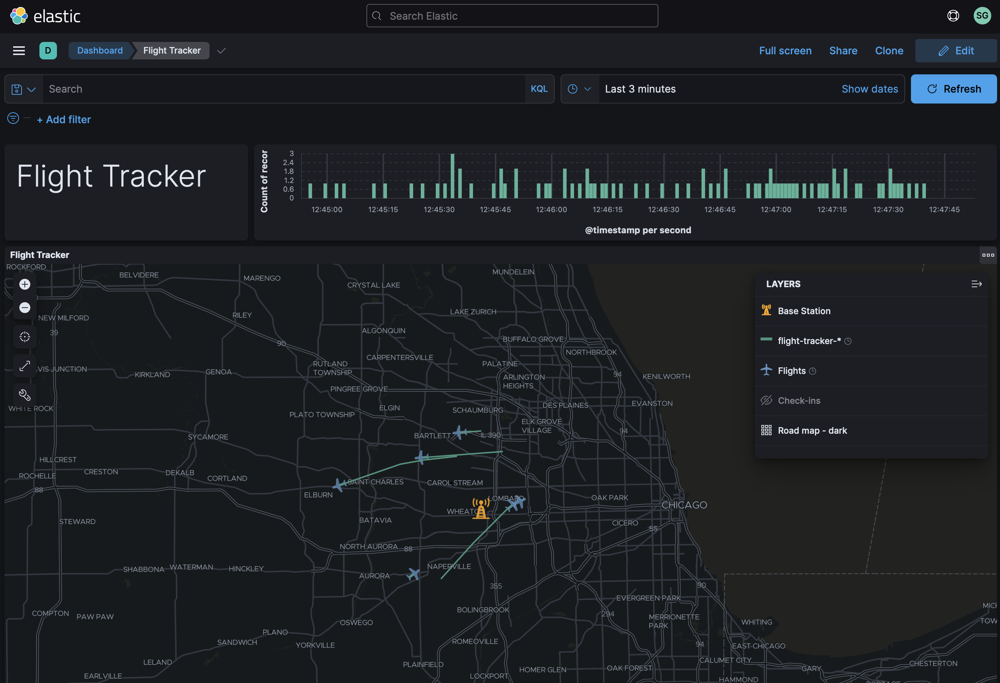
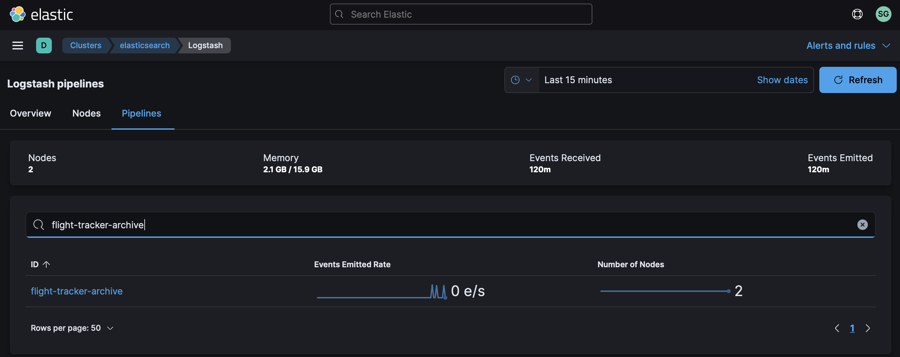
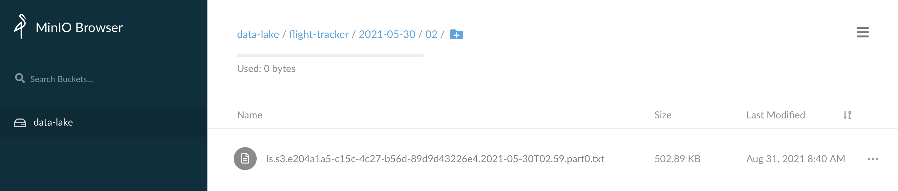
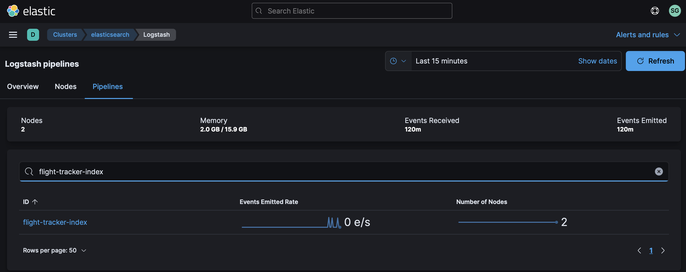

# Elastic Flight Tracker


For this data source, we'll be using an [SDR](https://www.amazon.com/gp/product/B01GDN1T4S) to track aircraft flights via [ADS-B](https://mode-s.org/decode/).  We'll use a Python script to decode the signals and write them to a log file.  Elastic's Filebeat will pick them up from there and handle getting them to Logstash.

We'll build the following dashboard with Elastic:



Let's get started!

## Step #1 - Collect Data

Create a new python script called `~/bin/flight-tracker.py` with the following contents:

​	[flight-tracker.py](flight-tracker.py)

The script requires that your SDR be plugged in before running.

Take a few minutes to familiarize yourself with the script.  Adjust the values of `<your_latitude>` and `<your_longitude>`.  You can use [LatLong.net](https://www.latlong.net/) to lookup your location.

When you're ready, try running the script:

```bash
chmod a+x ~/bin/flight-tracker.py
sudo ~/bin/flight-tracker.py
```

It may take a few minutes to see output if you're in a quiet airspace, but once ~10 messages have been received you should see output on `stdout` similar to:

```json
{"@timestamp": "2021-09-08T15:20:04.046427", "hex_ident": "A49DE9", "call_sign": null, "location": [42.05695, -88.04905], "altitude_ft": 31475, "speed_kts": 334, "track_angle_deg": 169, "vertical_speed_fpm": 3328, "speed_ref": "GS"}
{"@timestamp": "2021-09-08T15:20:03.330181", "hex_ident": "A1D4BC", "call_sign": "ENY4299", "location": [41.78804, -88.11425], "altitude_ft": 9675, "speed_kts": 292, "track_angle_deg": 41, "vertical_speed_fpm": -1792, "speed_ref": "GS"}
{"@timestamp": "2021-09-08T15:20:05.502300", "hex_ident": "ACC3B4", "call_sign": "AAL2080", "location": [41.91885, -88.03], "altitude_ft": 7600, "speed_kts": 289, "track_angle_deg": 45, "vertical_speed_fpm": -1536, "speed_ref": "GS"}
```

Once you confirm the script is working, you can redirect its output to a log file:

```bash
sudo touch /var/log/flight-tracker.log
sudo chown ubuntu.ubuntu /var/log/flight-tracker.log
```

Create a logrotate entry so the log file doesn't grow unbounded:

```bash
sudo vi /etc/logrotate.d/flight-tracker
```

Add the following logrotate content:

```
/var/log/flight-tracker.log {
  weekly
  rotate 12
  compress
  delaycompress
  missingok
  notifempty
  create 644 ubuntu ubuntu
}
```

Create a new bash script `~/bin/flight-tracker.sh` with the following:

```bash
#!/bin/bash

if pgrep -f "sudo /home/ubuntu/bin/flight-tracker.py" > /dev/null
then
    echo "Already running."
else
    echo "Not running.  Restarting..."
    sudo /home/ubuntu/bin/flight-tracker.py >> /var/log/flight-tracker.log 2>&1
fi
```

Make it executable:

```bash
chmod a+x ~/bin/flight-tracker.sh
```

Add the following entry to your crontab with `crontab -e`:

```
* * * * * /home/ubuntu/bin/flight-tracker.sh >> /tmp/flight-tracker.log 2>&1
```

Verify output by tailing the log file for a few minutes (since cron is only running the script at the start of each minute):

```bash
tail -f /var/log/flight-tracker.log
```

If you're seeing output every few seconds, then you are successfully collecting data!

## Step #2 - Archive Data

Once your data is ready to archive, we'll use Filebeat to send it to Logstash which will in turn sends it to S3.

Add the following to the Filebeat config `/etc/filebeat/filebeat.yml` on the host logging your CO2 data:

```yaml
filebeat.inputs:
  - type: log
    enabled: true
    tags: ["flight-tracker"]
    paths:
      - /var/log/flight-tracker.log
```

This tells Filebeat where the log file is located and it adds a tag to each event.  We'll refer to that tag in Logstash so we can easily isolate events from this data stream.

Restart Filebeat:

```bash
sudo systemctl restart filebeat
```

You may want to tail syslog to see if Filebeat restarts without any issues:

```bash
tail -f /var/log/syslog | grep filebeat
```

At this point, we should have Solar Enphase data flowing into Logstash.  By default however, our `distributor` pipeline in Logstash will put any unrecognized data in our Data Lake / S3 bucket called `NEEDS_CLASSIFIED`.  To change this, we're going to update the `distributor` pipeline to recognize the Solar Enphase data feed.

Add the following conditional to your `distributor.yml` file:

```
} else if "flight-tracker" in [tags] {
    pipeline {
        send_to => ["flight-tracker-archive"]
    }
}
```

Create a Logstash pipeline called `flight-tracker-archive.yml` with the following contents:

```
input {
    pipeline {
        address => "flight-tracker-archive"
    }
}
filter {
}
output {
    s3 {
        #
        # Custom Settings
        #
        prefix => "flight-tracker/%{+YYYY}-%{+MM}-%{+dd}/%{+HH}"
        temporary_directory => "${S3_TEMP_DIR}/flight-tracker-archive"
        access_key_id => "${S3_ACCESS_KEY}"
        secret_access_key => "${S3_SECRET_KEY}"
        endpoint => "${S3_ENDPOINT}"
        bucket => "${S3_BUCKET}"

        #
        # Standard Settings
        #
        validate_credentials_on_root_bucket => false
        codec => json_lines
        # Limit Data Lake file sizes to 5 GB
        size_file => 5000000000
        time_file => 60
        # encoding => "gzip"
        additional_settings => {
            force_path_style => true
            follow_redirects => false
        }
    }
}
```

Put this pipeline in your Logstash configuration directory so it gets loaded whenever Logstash restarts:

```bash
sudo mv flight-tracker-archive.yml /etc/logstash/conf.d/
```

Add the pipeline to your `/etc/logstash/pipelines.yml` file:

```
- pipeline.id: "flight-tracker-archive"
  path.config: "/etc/logstash/conf.d/flight-tracker-archive.conf"
```

And finally, restart the Logstash service:

```bash
sudo systemctl restart logstash
```

While Logstash is restarting, you can tail it's log file in order to see if there are any configuration errors:

```bash
sudo tail -f /var/log/logstash/logstash-plain.log
```

After a few seconds, you should see Logstash shutdown and start with the new pipeline and no errors being emitted.

Check your cluster's Stack Monitoring to see if we're getting events through the pipeline:



Check your S3 bucket to see if you're getting data directories created for the current date & hour with data:



If you see your data being stored, then you are successfully archiving!

## Step #3 - Index Data

Once Logstash is archiving the data, next we need to index it with Elastic.

We'll use Elastic's [Dynamic field mapping](https://www.elastic.co/guide/en/elasticsearch/reference/current/dynamic-field-mapping.html) feature to automatically create the right [Field data types](https://www.elastic.co/guide/en/elasticsearch/reference/current/mapping-types.html) for the majority of data we're sending in.  The one exception is for `geo_point` data which we need to explicitly add a mapping for, using an index template.

Jump into Kibana and create the following Index Template using Dev Tools:

```
PUT _index_template/flight-tracker
{
  "index_patterns": ["flight-tracker-*"],
  "template": {
    "settings": {},
    "mappings": {
      "properties": {
        "location": {
          "type": "geo_point"
        }
      }
    },
    "aliases": {}
  }
}
```

Using the [Logstash Toolkit](http://github.com/gose/logstash-toolkit), the following filter chain has been built that can parse the raw JSON coming in.

Create a new pipeline called `flight-tracker-index.yml` with the following content:

```
input {
  pipeline {
    address => "flight-tracker-index"
  }
}
filter {
  json {
    source => "message"
  }
  json {
    source => "message"
  }
  mutate {
    remove_field => ["message", "tags", "path"]
    remove_field => ["agent", "host", "input", "log", "ecs", "@version"]
  }
}
output {
  elasticsearch {
    #
    # Custom Settings
    #
    id => "flight-tracker-index"
    index => "flight-tracker-%{+YYYY.MM.dd}"
    hosts => "${ES_ENDPOINT}"
    user => "${ES_USERNAME}"
    password => "${ES_PASSWORD}"
  }
}
```

Put this pipeline in your Logstash configuration directory so it gets loaded in whenever Logstash restarts:

```bash
sudo mv flight-tracker-index.yml /etc/logstash/conf.d/
```

Add the pipeline to your `/etc/logstash/pipelines.yml` file:

```
- pipeline.id: "flight-tracker-index"
  path.config: "/etc/logstash/conf.d/flight-tracker-index.conf"
```

And finally, restart the Logstash service:

```bash
sudo systemctl restart logstash
```

While Logstash is restarting, you can tail it's log file in order to see if there are any configuration errors:

```bash
sudo tail -f /var/log/logstash/logstash-plain.log
```

After a few seconds, you should see Logstash shutdown and start with the new pipeline and no errors being emitted.

Check your cluster's Stack Monitoring to see if we're getting events through the pipeline:



## Step #4 - Visualize Data

Once Elasticsearch is indexing the data, we want to visualize it in Kibana.

Download this dashboard:  [flight-tracker.ndjson](flight-tracker.ndjson)

Jump back into Kibana:

1. Select "Stack Management" from the menu
2. Select "Saved Objects"
3. Click "Import" in the upper right

Once it's been imported, click on "Flight Tracker".


If you'd like to plot the location of your receiver (i.e., the orange tower in the Elastic Map), add the following document using Dev Tools (replacing the `lat` and`lon` with your location):

```JSON
PUT /flight-tracker-receiver/_doc/1
{
  "location": {
    "lat": 41.978611,
    "lon": -87.904724
  }
}
```

Congratulations!  You should now be looking at live flights in Elastic as they're being collected by your base station!
