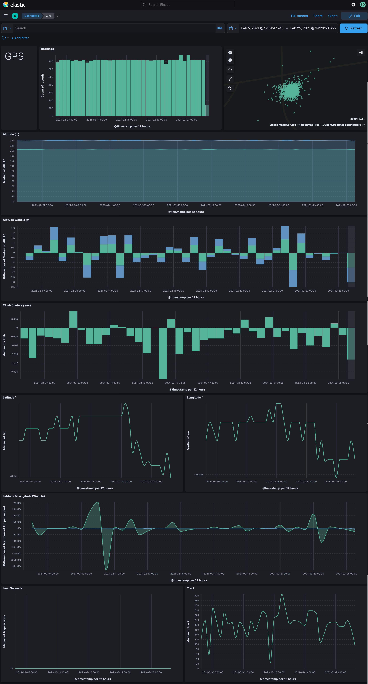
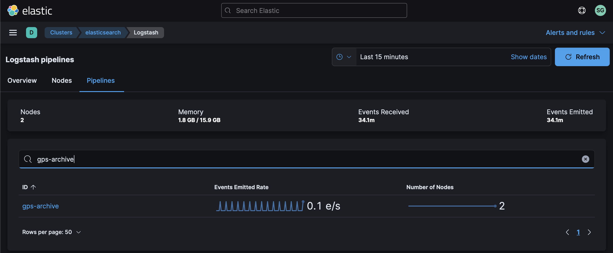
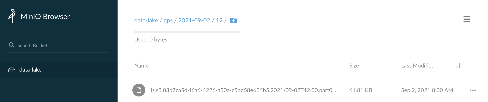

# GPS Monitoring


The [VK-162 GPS Receiver](https://www.pishop.us/product/gps-antenna-vk-162/) is a low cost, high sensitivity GPS Receiver with an internal antenna.   It provides location & speed tracking with a high degree of accuracy, and can be used in a number of applications.  It's built on the Ublox G6010 / G7020 low-power consumption GPS chipset and connects to a computer via USB where it can be read programmatically.

In this data source, we'll build the following dashboard with Elastic:



Let's get started!

## Step #1 - Collect Data

We use [gpsd](https://gpsd.gitlab.io/gpsd/) to query the GPS Receiver, and then [gpspipe](https://gpsd.gitlab.io/gpsd/gpspipe.html) to talk to `gpsd` to get location readings.

If this is your first time setting up `gpsd`, you can refer to the [installation instructions](https://gpsd.gitlab.io/gpsd/installation.html).

For Ubuntu systems, the installation process is as follows:

```bash
sudo apt install gpsd-clients gpsd
sudo systemctl enable gpsd	
```

Create a file called `/etc/default/gpsd` with the following contents (changing the device to your setup, if necessary):

```
DEVICES="/dev/ttyACM0"
```

Then start the `gpsd` service:

```bash
sudo systemctl start gpsd
```

And try querying it:

```bash
gpspipe -w
```

You should see output similar to the following:

 ```json
{"class":"VERSION","release":"3.20","rev":"3.20","proto_major":3,"proto_minor":14}
{"class":"DEVICES","devices":[{"class":"DEVICE","path":"/dev/ttyACM0","driver":"u-blox","subtype":"SW 1.00 (59842),HW 00070000","subtype1":",PROTVER 14.00,GPS;SBAS;GLO;QZSS","activated":"2021-09-02T19:13:12.267Z","flags":1,"native":1,"bps":9600,"parity":"N","stopbits":1,"cycle":1.00,"mincycle":0.25}]}
{"class":"WATCH","enable":true,"json":true,"nmea":false,"raw":0,"scaled":false,"timing":false,"split24":false,"pps":false}
{"class":"TPV","device":"/dev/ttyACM0","status":2,"mode":3,"time":"2021-09-02T19:13:13.000Z","leapseconds":18,"ept":0.005,"lat":41.868633156,"lon":-88.057113792,"altHAE":206.865,"altMSL":240.666,"alt":240.666,"track":14.3003,"magtrack":10.5762,"magvar":-3.7,"speed":0.088,"climb":0.010,"eps":0.67,"ecefx":160358.79,"ecefy":-4754122.42,"ecefz":4234974.21,"ecefvx":0.02,"ecefvy":0.05,"ecefvz":0.07,"ecefpAcc":10.77,"ecefvAcc":0.67,"velN":0.085,"velE":0.022,"velD":-0.010,"geoidSep":-33.801}
 ```

The main thing to look for are the `"class":"TPV"` objects which is are "time-position-velocity" reports.  All of the fields included are described in the document [Core Protocol Responses](https://gpsd.gitlab.io/gpsd/gpsd_json.html#_core_protocol_responses).

Create a new shell script called `~/bin/gps.sh` with the following contents:

```bash
#!/bin/bash

gpspipe -w -n 10 | grep TPV | tail -n 1
```

Try running the script:

```bash
chmod a+x ~/bin/gps.sh
~/bin/gps.sh
```

You should see output on `stdout` similar to:

```json
{"class":"TPV","device":"/dev/ttyACM0","status":2,"mode":3,"time":"2021-09-02T19:13:13.000Z","leapseconds":18,"ept":0.005,"lat":41.868633156,"lon":-88.057113792,"altHAE":206.865,"altMSL":240.666,"alt":240.666,"track":14.3003,"magtrack":10.5762,"magvar":-3.7,"speed":0.088,"climb":0.010,"eps":0.67,"ecefx":160358.79,"ecefy":-4754122.42,"ecefz":4234974.21,"ecefvx":0.02,"ecefvy":0.05,"ecefvz":0.07,"ecefpAcc":10.77,"ecefvAcc":0.67,"velN":0.085,"velE":0.022,"velD":-0.010,"geoidSep":-33.801}
```

Once you confirm the script is working, you can redirect its output to a log file:

```bash
sudo touch /var/log/gps.log
sudo chown ubuntu.ubuntu /var/log/gps.log
```

Create a logrotate entry so the log file doesn't grow unbounded:

```bash
sudo vi /etc/logrotate.d/gps
```

Add the following logrotate content:

```
/var/log/gps.log {
  weekly
  rotate 12
  compress
  delaycompress
  missingok
  notifempty
  create 644 ubuntu ubuntu
}
```

Add the following entry to your crontab with `crontab -e`:

```
* * * * * /home/ubuntu/bin/gps.sh >> /var/log/gps.log 2>&1
```

Verify output by tailing the log file for a few minutes (since cron is only running the script at the start of each minute):

```bash
tail -f /var/log/gps.log
```

If you're seeing output scroll each minute then you are successfully collecting data!

## Step #2 - Archive Data

Once your data is ready to archive, we'll use Filebeat to send it to Logstash which will in turn sends it to S3.

Add the following to the Filebeat config `/etc/filebeat/filebeat.yml` on the host logging your weather data:

```yaml
filebeat.inputs:
  - type: log
    enabled: true
    tags: ["gps"]
    paths:
      - /var/log/gps.log
```

This tells Filebeat where the log file is located and it adds a tag to each event.  We'll refer to that tag in Logstash so we can easily isolate events from this data stream.

Restart Filebeat:

```bash
sudo systemctl restart filebeat
```

You may want to tail syslog to see if Filebeat restarts without any issues:

```bash
tail -f /var/log/syslog | grep filebeat
```

At this point, we should have GPS data flowing into Logstash.  By default however, our `distributor` pipeline in Logstash will put any unrecognized data in our Data Lake / S3 bucket called `NEEDS_CLASSIFIED`.  To change this, we're going to update the `distributor` pipeline to recognize the weather station data feed.

Add the following conditional to your `distributor.yml` file:

```
} else if "gps" in [tags] {
    pipeline {
        send_to => ["gps-archive"]
    }
}
```

Create a Logstash pipeline called `gps-archive.yml` with the following contents:

```
input {
    pipeline {
        address => "gps-archive"
    }
}
filter {
}
output {
    s3 {
        #
        # Custom Settings
        #
        prefix => "gps/%{+YYYY}-%{+MM}-%{+dd}/%{+HH}"
        temporary_directory => "${S3_TEMP_DIR}/gps-archive"
        access_key_id => "${S3_ACCESS_KEY}"
        secret_access_key => "${S3_SECRET_KEY}"
        endpoint => "${S3_ENDPOINT}"
        bucket => "${S3_BUCKET}"

        #
        # Standard Settings
        #
        validate_credentials_on_root_bucket => false
        codec => json_lines
        # Limit Data Lake file sizes to 5 GB
        size_file => 5000000000
        time_file => 60
        # encoding => "gzip"
        additional_settings => {
            force_path_style => true
            follow_redirects => false
        }
    }
}
```

Put this pipeline in your Logstash configuration directory so it gets loaded whenever Logstash restarts:

```bash
sudo mv gps-archive.yml /etc/logstash/conf.d/
```

Add the pipeline to your `/etc/logstash/pipelines.yml` file:

```
- pipeline.id: "gps-archive"
  path.config: "/etc/logstash/conf.d/gps-archive.conf"
```

And finally, restart the Logstash service:

```bash
sudo systemctl restart logstash
```

While Logstash is restarting, you can tail it's log file in order to see if there are any configuration errors:

```bash
sudo tail -f /var/log/logstash/logstash-plain.log
```

After a few seconds, you should see Logstash shutdown and start with the new pipeline and no errors being emitted.

Check your cluster's Stack Monitoring to see if we're getting events through the pipeline:



Check your S3 bucket to see if you're getting data directories created for the current date & hour with data:



If you see your data being stored, then you are successfully archiving!

## Step #3 - Index Data

Once Logstash is archiving the data, we need to index it with Elastic.

We'll use Elastic's [Dynamic field mapping](https://www.elastic.co/guide/en/elasticsearch/reference/current/dynamic-field-mapping.html) feature to automatically create the right [Field data types](https://www.elastic.co/guide/en/elasticsearch/reference/current/mapping-types.html) for the majority of data we're sending in.  The one exception is for `geo_point` data which we need to explicitly add a mapping for, using an index template.

Jump into Kibana and create the following Index Template using Dev Tools:

```
PUT _index_template/gps
{
  "index_patterns": ["gps-*"],
  "template": {
    "settings": {},
    "mappings": {
      "properties": {
        "location": {
          "type": "geo_point"
        }
      }
    },
    "aliases": {}
  }
}
```

Using the [Logstash Toolkit](http://github.com/gose/logstash-toolkit), the following filter chain has been built that can parse the raw JSON coming in.

Create a new pipeline called `gps-index.yml` with the following content:

```
input {
    pipeline {
        address => "gps-index"
    }
}
filter { 
    json {
        source => "message"
    }
    json {
        source => "message"
    }
    mutate {
        remove_field => ["message", "agent", "host", "input", "log", "host", "ecs", "@version"]
    }
    mutate {
        add_field => { "[location]" => "%{[lat]}, %{[lon]}" }
    }
}
output {
    elasticsearch {
        #
        # Custom Settings
        #
        id => "gps-index"
        index => "gps-%{+YYYY.MM.dd}"
        hosts => "${ES_ENDPOINT}"
        user => "${ES_USERNAME}"
        password => "${ES_PASSWORD}"
    }
}
```

Put this pipeline in your Logstash configuration directory so it gets loaded in whenever Logstash restarts:

```bash
sudo mv gps-index.yml /etc/logstash/conf.d/
```

Add the pipeline to your `/etc/logstash/pipelines.yml` file:

```
- pipeline.id: "gps-index"
  path.config: "/etc/logstash/conf.d/gps-index.conf"
```

And finally, restart the Logstash service:

```bash
sudo systemctl restart logstash
```

While Logstash is restarting, you can tail it's log file in order to see if there are any configuration errors:

```bash
sudo tail -f /var/log/logstash/logstash-plain.log
```

After a few seconds, you should see Logstash shutdown and start with the new pipeline and no errors being emitted.

Check your cluster's Stack Monitoring to see if we're getting events through the pipeline:


## Step #4 - Visualize Data

Once Elasticsearch is indexing the data, we want to visualize it in Kibana.

Download this dashboard:

​	[gps.ndjson](gps.ndjson)

Jump into Kibana:

1. Select "Stack Management" from the menu
2. Select "Saved Objects"
3. Click "Import" in the upper right


Congratulations!  You should now be looking at data from your GPS in Elastic.
