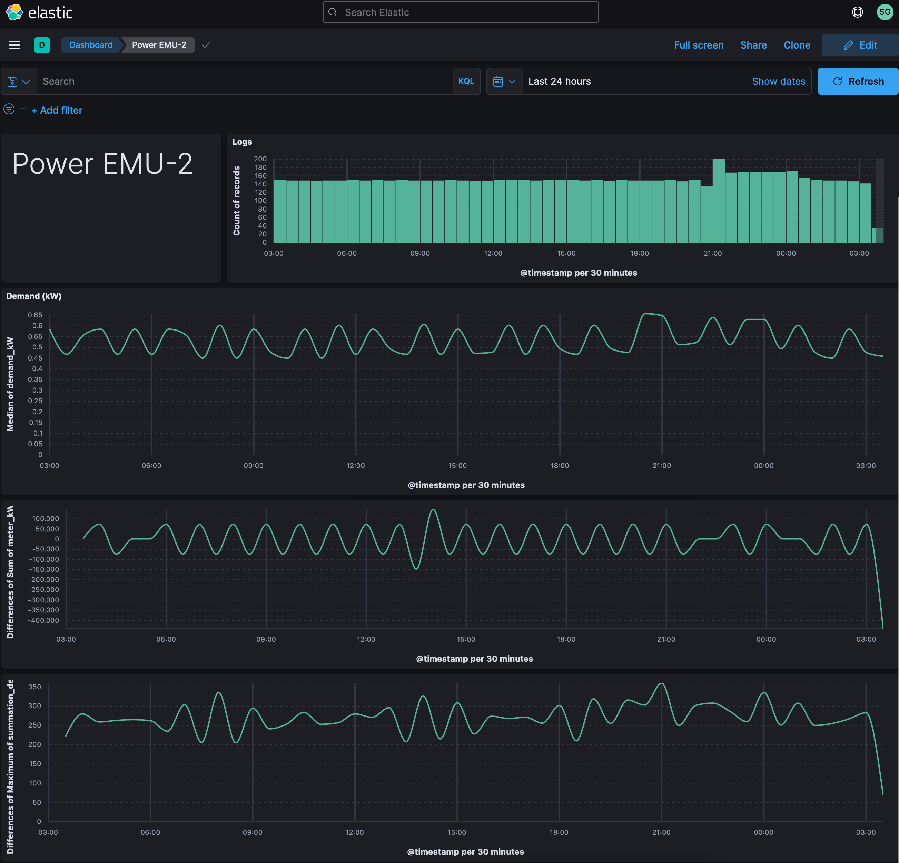
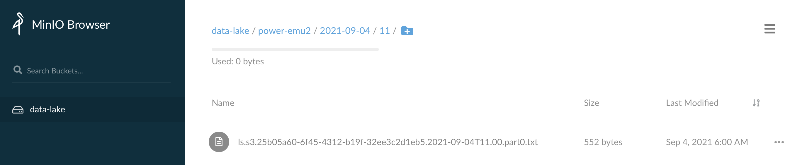
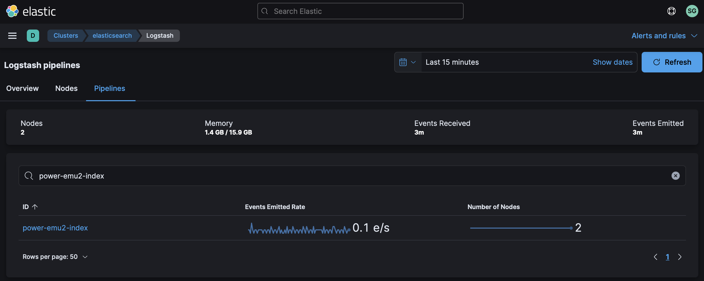

# Monitoring Power with EMU-2


The [EMU-2](https://www.rainforestautomation.com/rfa-z105-2-emu-2-2/) by Rainforest Automation displays your smart meter's data in real time.  We'll connect to it via USB and use a Python script to receive its messages.  The device should output the current demand (kW), current meter reading, and even the current price per kWh.

Our goal is to build the following dashboard:



Let's get started.

## Step #1 - Collect Data

Create a new python script called `~/bin/power-emu.py` with the following contents:

​	[power-emu2.py](power-emu2.py)

You might need to adjust the USB port in the script, to match your needs.  Look for `/dev/ttyACM1` in the script.

Decoding the messages from the EMU-2 can be tricky.  There are technical documents to aid the process if you want to dig deeper than the provided Python script:

* [Emu-2-Tech-Guide-1.05.pdf](https://github.com/rainforestautomation/Emu-Serial-API/blob/master/Emu-2-Tech-Guide-1.05.pdf)
* [RAVEn. XML API Manual.pdf](https://rainforestautomation.com/wp-content/uploads/2014/02/raven_xml_api_r127.pdf)

Try running the script from the command line:

```bash
chmod a+x ~/bin/power-emu2.py
sudo ~/bin/power-emu2.py
```

The output will include a JSON-formatted summary of each power outlet's metrics.

```json
{"message": "Starting", "timestamp": "2021-09-06T07:55:42Z", "status": "connected"}
{"message": "InstantaneousDemand", "timestamp": "2021-09-06T07:55:23Z", "demand_kW": 0.558}
{"message": "InstantaneousDemand", "timestamp": "2021-09-06T07:55:53Z", "demand_kW": 0.585}
{"message": "InstantaneousDemand", "timestamp": "2021-09-06T07:56:08Z", "demand_kW": 0.63}
{"message": "CurrentSummationDelivered", "timestamp": "2021-09-06T07:56:11Z", "summation_delivered": 73438571, "summation_received": 0, "meter_kWh": 73438.571}
{"message": "PriceCluster", "timestamp": "2021-09-06T07:56:51Z", "price_cents_kWh": 5.399, "currency": 840, "tier": 0, "start_time": "2021-09-06T07:50:00Z", "duration": 1440}
```

Hit `^c` to quite the script.

Once you're able to successfully query the power strip, create a log file for its output:

```bash
sudo touch /var/log/power-emu2.log
sudo chown ubuntu.ubuntu /var/log/power-emu2.log
```

Create a logrotate entry so the log file doesn't grow unbounded:

```
sudo vi /etc/logrotate.d/power-emu2
```

Add the following content:

```
/var/log/power-emu2.log {
  weekly
  rotate 12
  compress
  delaycompress
  missingok
  notifempty
  create 644 ubuntu ubuntu
}
```

Create a new bash script `~/bin/power-emu2.sh` with the following:

```bash
#!/bin/bash

if pgrep -f "sudo /home/ubuntu/bin/power-emu2.py" > /dev/null
then
    echo "Already running."
else
    echo "Not running.  Restarting..."
    sudo /home/ubuntu/bin/power-emu2.py >> /var/log/power-emu2.log 2>&1
fi
```

Add the following entry to your crontab:

```
* * * * * /home/ubuntu/bin/power-emu2.sh >> /tmp/power-emu2.log 2>&1
```

Verify output by tailing the log file for a few minutes:

```
tail -f /var/log/power-emu2.log
```

If you're seeing output scroll each minute then you are successfully collecting data!

## Step #2 - Archive Data

Once your data is ready to archive, we'll use Filebeat to send it to Logstash which will in turn sends it to S3.

Add the following to the Filebeat config `/etc/filebeat/filebeat.yml` on the host logging your EMU-2 data:

```yaml
filebeat.inputs:
  - type: log
    enabled: true
    tags: ["power-emu2"]
    paths:
      - /var/log/power-emu2.log
```

This tells Filebeat where the log file is located and it adds a tag to each event.  We'll refer to that tag in Logstash so we can easily isolate events from this data stream.

Restart Filebeat:

```bash
sudo systemctl restart filebeat
```

You may want to tail syslog to see if Filebeat restarts without any issues:

```bash
tail -f /var/log/syslog | grep filebeat
```

At this point, we should have EMU-2 data flowing into Logstash.  By default however, our `distributor` pipeline in Logstash will put any unrecognized data in our Data Lake / S3 bucket called `NEEDS_CLASSIFIED`.  To change this, we're going to update the `distributor` pipeline to recognize the EMU-2 data feed.

Add the following conditional to your `distributor.yml` file:

```
} else if "power-emu2" in [tags] {
    pipeline {
        send_to => ["power-emu2-archive"]
    }
}
```

Create a Logstash pipeline called `power-emu2-archive.yml` with the following contents:

```
input {
    pipeline {
        address => "power-emu2-archive"
    }
}
filter {
}
output {
    s3 {
        #
        # Custom Settings
        #
        prefix => "power-emu2/%{+YYYY}-%{+MM}-%{+dd}/%{+HH}"
        temporary_directory => "${S3_TEMP_DIR}/power-emu2-archive"
        access_key_id => "${S3_ACCESS_KEY}"
        secret_access_key => "${S3_SECRET_KEY}"
        endpoint => "${S3_ENDPOINT}"
        bucket => "${S3_BUCKET}"

        #
        # Standard Settings
        #
        validate_credentials_on_root_bucket => false
        codec => json_lines
        # Limit Data Lake file sizes to 5 GB
        size_file => 5000000000
        time_file => 60
        # encoding => "gzip"
        additional_settings => {
            force_path_style => true
            follow_redirects => false
        }
    }
}
```

Put this pipeline in your Logstash configuration directory so it gets loaded whenever Logstash restarts:

```bash
sudo mv power-emu2-archive.yml /etc/logstash/conf.d/
```

Add the pipeline to your `/etc/logstash/pipelines.yml` file:

```
- pipeline.id: "power-emu2-archive"
  path.config: "/etc/logstash/conf.d/power-emu2-archive.conf"
```

And finally, restart the Logstash service:

```bash
sudo systemctl restart logstash
```

While Logstash is restarting, you can tail it's log file in order to see if there are any configuration errors:

```bash
sudo tail -f /var/log/logstash/logstash-plain.log
```

After a few seconds, you should see Logstash shutdown and start with the new pipeline and no errors being emitted.

Check your cluster's Stack Monitoring to see if we're getting events through the pipeline:


Check your S3 bucket to see if you're getting data directories created for the current date & hour with data:



If you see your data being stored, then you are successfully archiving!

## Step #3 - Index Data

Once Logstash is archiving the data, next we need to index it with Elastic.

We'll use Elastic's [Dynamic field mapping](https://www.elastic.co/guide/en/elasticsearch/reference/current/dynamic-field-mapping.html) feature to automatically create the right [Field data types](https://www.elastic.co/guide/en/elasticsearch/reference/current/mapping-types.html) for the data we're sending in.  

Using the [Logstash Toolkit](http://github.com/gose/logstash-toolkit), the following filter chain has been built that can parse the raw JSON coming in.

Create a new pipeline called `power-emu2-index.yml` with the following content:

```
input {
    pipeline {
        address => "power-emu2-index"
    }
}
filter {
    json {
        source => "message"
        skip_on_invalid_json => true
    }
    json {
        source => "message"
        skip_on_invalid_json => true
    }
    date {
        match => ["timestamp", "ISO8601"]
    }
    mutate {
        remove_field => ["timestamp"]
        remove_field => ["log", "input", "agent", "tags", "@version", "ecs", "host"]
    }
}
output {
    elasticsearch {
        #
        # Custom Settings
        #
        id => "power-emu2-index"
        index => "power-emu2-%{+YYYY.MM.dd}"
        hosts => "${ES_ENDPOINT}"
        user => "${ES_USERNAME}"
        password => "${ES_PASSWORD}"
    }
}
```

Put this pipeline in your Logstash configuration directory so it gets loaded in whenever Logstash restarts:

```bash
sudo mv power-emu2-index.yml /etc/logstash/conf.d/
```

Add the pipeline to your `/etc/logstash/pipelines.yml` file:

```
- pipeline.id: "power-emu2-index"
  path.config: "/etc/logstash/conf.d/power-emu2-index.conf"
```

Append your new pipeline to your tagged data in the `distributor.yml` pipeline:

```
} else if "power-emu2" in [tags] {
    pipeline {
        send_to => ["power-emu2-archive", "power-emu2-index"]
    }
}
```

And finally, restart the Logstash service:

```bash
sudo systemctl restart logstash
```

While Logstash is restarting, you can tail it's log file in order to see if there are any configuration errors:

```bash
sudo tail -f /var/log/logstash/logstash-plain.log
```

After a few seconds, you should see Logstash shutdown and start with the new pipeline and no errors being emitted.

Check your cluster's Stack Monitoring to see if we're getting events through the pipeline:



## Step #4 - Visualize Data

Once Elasticsearch is indexing the data, we want to visualize it in Kibana.

Download this dashboard:  [power-emu2.ndjson](power-emu2.ndjson)

Jump back into Kibana:

1. Select "Stack Management" from the menu
2. Select "Saved Objects"
3. Click "Import" in the upper right

Once it's been imported, click on "Power EMU-2".


Congratulations!  You should now be looking at power data from your EMU-2 in Elastic.