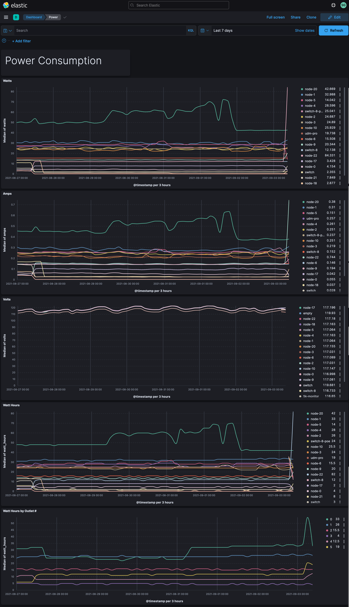
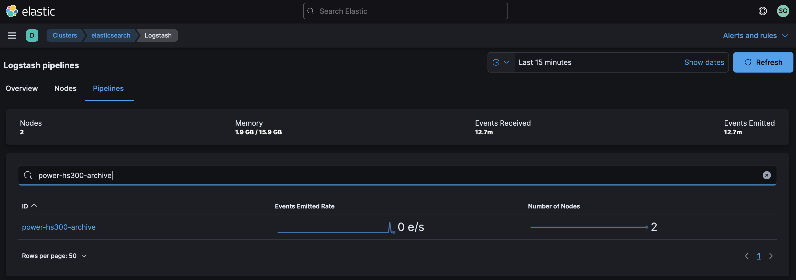
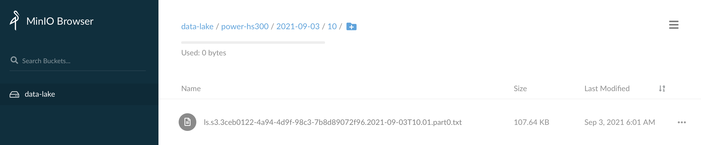

# Monitoring Power with HS300


The [Kasa Smart Wi-Fi Power Strip (HS300)](https://www.kasasmart.com/us/products/smart-plugs/kasa-smart-wi-fi-power-strip-hs300) is a consumer-grade power strip that allows you to independently control and monitor 6 smart outlets (and charge 3 devices with built-in USB ports).  The power strip can be controlled via the Kasa Smart [iPhone](https://apps.apple.com/us/app/kasa-smart/id1034035493) app or [Android](https://play.google.com/store/apps/details?id=com.tplink.kasa_android&hl=en_US&gl=US) app.  Furthermore, you can query it via API to get the electrical properties of each outlet.  For example:

* Voltage
* Current
* Watts
* Watts per hour

We'll use a Python script to query it each minute via a cron job, and redirect the output to a log file.  From there, Filebeat will pick it up and send it into Elastic.  Many data center grade PSUs also provide ways to query individual outlet metrics.  A similar script could be written to extract this information in a commercial setting.

In general, this exercise is meant to bring transparency to the cost of electricity to run a set of machines.  If we know how much power a machine is consuming, we can calculate its electricity cost based on utility rates.



Let's get started.

## Step #1 - Collect Data

Install the following Python module that knows how to query the power strip:

```bash
pip3 install pyhs100
```

Find the IP address of the power strip:

```bash
pyhs100 discover | grep IP
```

This should return an IP address for each HS300 on your network:

```
Host/IP: 192.168.1.5
Host/IP: 192.168.1.6
```

Try querying the power strip:

```bash
/home/ubuntu/.local/bin/pyhs100 --ip 192.168.1.5 emeter
```

You should see output similar to:

```
{0: {'voltage_mv': 112807, 'current_ma': 239, 'power_mw': 24620, 'total_wh': 12}, 1: {'voltag_mv': 112608, 'current_ma': 243, 'power_mw': 23948, 'total_wh': 12}, 2: {'voltage_mv': 112608, 'current_ma': 238, 'power_mw': 23453, 'total_wh': 11}, 3: {'voltage_mv': 112509, 'current_ma': 70, 'power_mw': 5399, 'total_wh': 4}, 4: {'voltage_mv': 112409, 'current_ma': 93, 'power_mw': 3130, 'total_wh': 1}, 5: {'voltage_mv': 109030, 'current_ma': 78, 'power_mw': 5787, 'total_wh': 2}}
```

This is not properly formatted JSON, but the script included with this data source will help clean it up.

After you've verified that you can query the power strip, download the following script and open it in your favorite editor:

[power-hs300.py](power-hs300.py)

Modify the script with the following:

* Change the IP addresses to match that of your power strip(s)
* Change the directory location of the `pyhs100` command
* Change the names of each outlet in the `hosts` dictionary
* Change the `label` argument in the `query_power_strip()` function calls

Try running the script from the command line:

```bash
chmod a+x ~/bin/power-hs300.py
~/bin/power-hs300.py
```

The output will include a JSON-formatted summary of each power outlet's metrics.

```json
{"@timestamp": "2021-02-08T14:32:11.611868", "outlets": [{"ip": "192.168.1.5", "outlet": 0, "name": "node-1", "volts": 112.393, "amps": 0.254, "watts": 25.425, "label": "office"}, ...]}
```

  When pretty-printed, it will look like this:

```json
{
	"@timestamp": "2021-02-08T14:32:11.611868",
	"outlets": [
		{
			"ip": "192.168.1.5",
			"label": "office",
			"outlet": 0,
			"name": "node-1",
			"volts": 112.393,
			"amps": 0.254,
			"watts": 25.425
		},
		...
	]
}
```

Once you're able to successfully query the power strip, create a log file for its output:

```bash
sudo touch /var/log/power-hs300.log
sudo chown ubuntu.ubuntu /var/log/power-hs300.log
```

Create a logrotate entry so the log file doesn't grow unbounded:

```
sudo vi /etc/logrotate.d/power-hs300
```

Add the following content:

```
/var/log/power-hs300.log {
  weekly
  rotate 12
  compress
  delaycompress
  missingok
  notifempty
  create 644 ubuntu ubuntu
}
```

Add the following entry to your crontab:

```
* * * * * /home/ubuntu/bin/power-hs300.py >> /var/log/power-hs300.log 2>&1
```

Verify output by tailing the log file for a few minutes:

```
$ tail -f /var/log/power-hs300.log
```

If you're seeing output scroll each minute then you are successfully collecting data!

## Step #2 - Archive Data

Once your data is ready to archive, we'll use Filebeat to send it to Logstash which will in turn sends it to S3.

Add the following to the Filebeat config `/etc/filebeat/filebeat.yml` on the host logging your HS300 data:

```yaml
filebeat.inputs:
  - type: log
    enabled: true
    tags: ["power-hs300"]
    paths:
      - /var/log/power-hs300.log
```

This tells Filebeat where the log file is located and it adds a tag to each event.  We'll refer to that tag in Logstash so we can easily isolate events from this data stream.

Restart Filebeat:

```bash
sudo systemctl restart filebeat
```

You may want to tail syslog to see if Filebeat restarts without any issues:

```bash
tail -f /var/log/syslog | grep filebeat
```

At this point, we should have HS300 data flowing into Logstash.  By default however, our `distributor` pipeline in Logstash will put any unrecognized data in our Data Lake / S3 bucket called `NEEDS_CLASSIFIED`.  To change this, we're going to update the `distributor` pipeline to recognize the HS300 data feed.

Add the following conditional to your `distributor.yml` file:

```
} else if "power-hs300" in [tags] {
    pipeline {
        send_to => ["power-hs300-archive"]
    }
}
```

Create a Logstash pipeline called `power-hs300-archive.yml` with the following contents:

```
input {
    pipeline {
        address => "power-hs300-archive"
    }
}
filter {
}
output {
    s3 {
        #
        # Custom Settings
        #
        prefix => "power-hs300/%{+YYYY}-%{+MM}-%{+dd}/%{+HH}"
        temporary_directory => "${S3_TEMP_DIR}/power-hs300-archive"
        access_key_id => "${S3_ACCESS_KEY}"
        secret_access_key => "${S3_SECRET_KEY}"
        endpoint => "${S3_ENDPOINT}"
        bucket => "${S3_BUCKET}"

        #
        # Standard Settings
        #
        validate_credentials_on_root_bucket => false
        codec => json_lines
        # Limit Data Lake file sizes to 5 GB
        size_file => 5000000000
        time_file => 60
        # encoding => "gzip"
        additional_settings => {
            force_path_style => true
            follow_redirects => false
        }
    }
}
```

Put this pipeline in your Logstash configuration directory so it gets loaded whenever Logstash restarts:

```bash
sudo mv power-hs300-archive.yml /etc/logstash/conf.d/
```

Add the pipeline to your `/etc/logstash/pipelines.yml` file:

```
- pipeline.id: "power-hs300-archive"
  path.config: "/etc/logstash/conf.d/power-hs300-archive.conf"
```

And finally, restart the Logstash service:

```bash
sudo systemctl restart logstash
```

While Logstash is restarting, you can tail it's log file in order to see if there are any configuration errors:

```bash
sudo tail -f /var/log/logstash/logstash-plain.log
```

After a few seconds, you should see Logstash shutdown and start with the new pipeline and no errors being emitted.

Check your cluster's Stack Monitoring to see if we're getting events through the pipeline:



Check your S3 bucket to see if you're getting data directories created for the current date & hour with data:



If you see your data being stored, then you are successfully archiving!

## Step #3 - Index Data

Once Logstash is archiving the data, next we need to index it with Elastic.

We'll use Elastic's [Dynamic field mapping](https://www.elastic.co/guide/en/elasticsearch/reference/current/dynamic-field-mapping.html) feature to automatically create the right [Field data types](https://www.elastic.co/guide/en/elasticsearch/reference/current/mapping-types.html) for the data we're sending in.  

Using the [Logstash Toolkit](http://github.com/gose/logstash-toolkit), the following filter chain has been built that can parse the raw JSON coming in.

Create a new pipeline called `power-hs300-index.yml` with the following content:

```
input {
    pipeline {
        address => "power-hs300-index"
    }
}
filter {
    mutate {
        remove_field => ["log", "input", "agent", "tags", "@version", "ecs", "host"]
    }
    json {
        source => "message"
        skip_on_invalid_json => true
    }
    if "_jsonparsefailure" in [tags] {
      drop { }
    }
    split {
        field => "outlets"
    }
    ruby {
        code => "
            event.get('outlets').each do |k, v|
                event.set(k, v)
                if k == '@timestamp'
                    event.set(k, v + 'Z')
                end
            end
            event.remove('outlets')
        "
    }
    if "_rubyexception" in [tags] {
      drop { }
    }
    mutate {
        remove_field => ["message"]
        remove_field => ["@version"]
    }
}
output {
    elasticsearch {
        #
        # Custom Settings
        #
        id => "power-hs300-index"
        index => "power-hs300-%{+YYYY.MM.dd}"
        hosts => "${ES_ENDPOINT}"
        user => "${ES_USERNAME}"
        password => "${ES_PASSWORD}"
    }
}
```

Put this pipeline in your Logstash configuration directory so it gets loaded in whenever Logstash restarts:

```bash
sudo mv power-hs300-index.yml /etc/logstash/conf.d/
```

Add the pipeline to your `/etc/logstash/pipelines.yml` file:

```
- pipeline.id: "power-hs300-index"
  path.config: "/etc/logstash/conf.d/power-hs300-index.conf"
```

And finally, restart the Logstash service:

```bash
sudo systemctl restart logstash
```

While Logstash is restarting, you can tail it's log file in order to see if there are any configuration errors:

```bash
sudo tail -f /var/log/logstash/logstash-plain.log
```

After a few seconds, you should see Logstash shutdown and start with the new pipeline and no errors being emitted.

Check your cluster's Stack Monitoring to see if we're getting events through the pipeline:


## Step #4 - Visualize Data

Once Elasticsearch is indexing the data, we want to visualize it in Kibana.

Download this dashboard:  [power-hs300.ndjson](power-hs300.ndjson)

Jump back into Kibana:

1. Select "Stack Management" from the menu
2. Select "Saved Objects"
3. Click "Import" in the upper right

Once it's been imported, click on "Power HS300".


Congratulations!  You should now be looking at power data from your HS300 in Elastic.