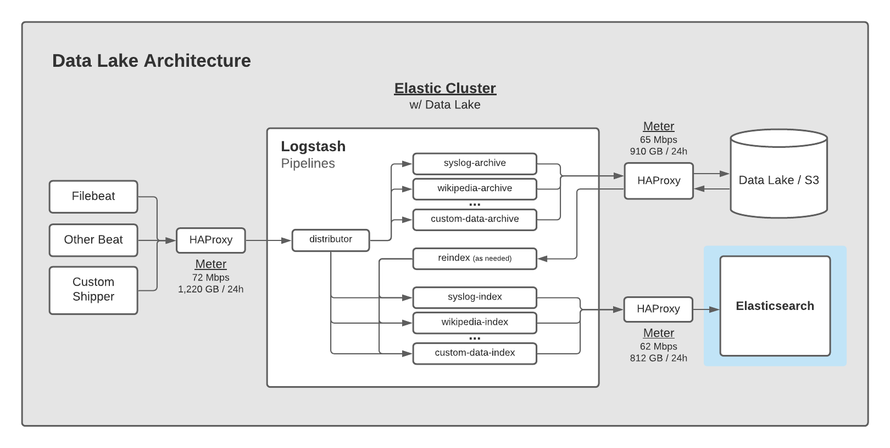

# Data Lake Setup

To build the architecture for the Elastic Data Lake, you'll need
these components:

* Logstash
* HAProxy (or equivalent)
* S3 Data Store (or equivalent)
* Elastic Cluster

Here is the architecture we're building:



## Prerequisites

This guide depends on you having an S3 store and Elasticsearch
cluster already running.  We'll use [Elastic Cloud](https://elastic.co)
to run our Elasticsearch cluster and
[Minio](https://www.digitalocean.com/community/tutorials/how-to-set-up-an-object-storage-server-using-minio-on-ubuntu-18-04)
as an S3 data store (or any S3-compliant service).

## Step 1 - Logstash

Identify the host you want to run Logstash.  Depending on the volume
of ingest you anticipate, you may want to run Logstash on multiple
hosts (or containers).  It scales easily so putting HAProxy in front
of it (which we'll do next) will make it easy to add more capacity.

Follow these instructions to get Logstash up and running:

[https://www.elastic.co/guide/en/logstash/current/installing-logstash.html](https://www.elastic.co/guide/en/logstash/current/installing-logstash.html)

Next, create a [Logstash
keystore](https://www.elastic.co/guide/en/logstash/current/keystore.html)
to store sensitive information and variables:

```
$ export LOGSTASH_KEYSTORE_PASS=mypassword
$ sudo -E /usr/share/logstash/bin/logstash-keystore --path.settings /etc/logstash create
```

Note:  Store this password somewhere safe.  You will also need to
add it to the environment that starts the Logstash process.

We'll use the keystore to fill in variables about our Elasticsearch cluster:

```
$ sudo -E /usr/share/logstash/bin/logstash-keystore --path.settings /etc/logstash add ES_ENDPOINT
$ sudo -E /usr/share/logstash/bin/logstash-keystore --path.settings /etc/logstash add ES_USERNAME
$ sudo -E /usr/share/logstash/bin/logstash-keystore --path.settings /etc/logstash add ES_PASSWORD
```

The `ES_ENDPOINT` value should be a full domain with `https` prefix and `:9243` port suffix.
For example:

```
https://elasticsearch.my-domain.com:9243
```

We'll also use the keystore to fill in variables about our S3 bucket:

```
$ sudo -E /usr/share/logstash/bin/logstash-keystore --path.settings /etc/logstash add S3_ENDPOINT
$ sudo -E /usr/share/logstash/bin/logstash-keystore --path.settings /etc/logstash add S3_BUCKET
$ sudo -E /usr/share/logstash/bin/logstash-keystore --path.settings /etc/logstash add S3_ACCESS_KEY
$ sudo -E /usr/share/logstash/bin/logstash-keystore --path.settings /etc/logstash add S3_SECRET_KEY
$ sudo -E /usr/share/logstash/bin/logstash-keystore --path.settings /etc/logstash add S3_DATE_DIR
$ sudo -E /usr/share/logstash/bin/logstash-keystore --path.settings /etc/logstash add S3_TEMP_DIR
```

The `S3_DATE_DIR` variable is used to organize your data into
`date/time` directories in the Data Lake.  For example,
`data-source/2021-01-01/13-04` will contain data collected January
1, 2021 during the minute 1:04PM GMT.  Organizing your data in this
manner gives you good granularity in terms of identifying what time
windows you may want to re-index in the future.  It allows you to
reindex data from a year, month, day, hour, or minute interval.

The recommended value for `S3_DATE_DIR` is:

```
%{+YYYY}-%{+MM}-%{+dd}/%{+HH}-%{+mm}
```

The `S3_TEMP_DIR` variable should point to a directory where Logstash
can temporarily store events.  Since this directory will contain
events, you may need to make it secure so that only the Logstash
process can read it (in addition to write to it).

If Logstash is running on an isolated host, you may set it to:

```
/tmp/logstash
```

### Dead Letter Queue (DLQ)

Enable the Logstash's [Dead Letter Queue](https://www.elastic.co/guide/en/logstash/current/dead-letter-queues.html) behavior.

Add the following configuration to `/etc/logstash/logstash.yml`:

```
dead_letter_queue.enable: true
```

In the Logstash pipeline
[dead-letter-queue-archive.yml](dead-letter-queue-archive.yml), be
sure to create the necessary directories for each pipeline to
temporarily store events.  For example:

```
$ sudo mkdir -p /tmp/logstash/dead-letter-queue/system-filebeat-module-structure
$ sudo chown -R logstash.logstash /tmp/logstash/dead-letter-queue
```

### Centralized Pipeline Management

We'll configure Logstash to use Centralized Pipeline Management so
that we can manage its pipelines from Kibana.  Add the following
configuration to `/etc/logstash/logstash.yml`:

```
#
# X-Pack Management
#
xpack.management.enabled: true
xpack.management.pipeline.id:
  - "distributor"
  - "dead-letter-archive"
  - "dead-letter-reindex"
  - "dead-letter-structure"
  - "haproxy-filebeat-module-archive"
  - "haproxy-filebeat-module-reindex"
  - "haproxy-filebeat-module-structure"
  - "haproxy-metricbeat-module-archive"
  - "haproxy-metricbeat-module-reindex"
  - "haproxy-metricbeat-module-structure"
  - "system-filebeat-module-archive"
  - "system-filebeat-module-reindex"
  - "system-filebeat-module-structure"
  - "utilization-archive"
  - "utilization-reindex"
  - "utilization-structure"
xpack.management.elasticsearch.username: "${ES_USERNAME}"
xpack.management.elasticsearch.password: "${ES_PASSWORD}"
xpack.management.elasticsearch.hosts: ["${ES_ENDPOINT}"]
```

You may trim the `pipeline.id` list if you are not going to be
collecting what's listed.

## Step 2 - HAProxy

Identify the host you want to run HAProxy.  Many Linux distributions
support installation from the standard distribution.

In Ubuntu, run:

```
$ sudo apt install haproxy
```

In Redhat, run:

```
$ sudo yum install haproxy
```

A sample configuration file is provided: [haproxy.cfg](haproxy.cfg)
