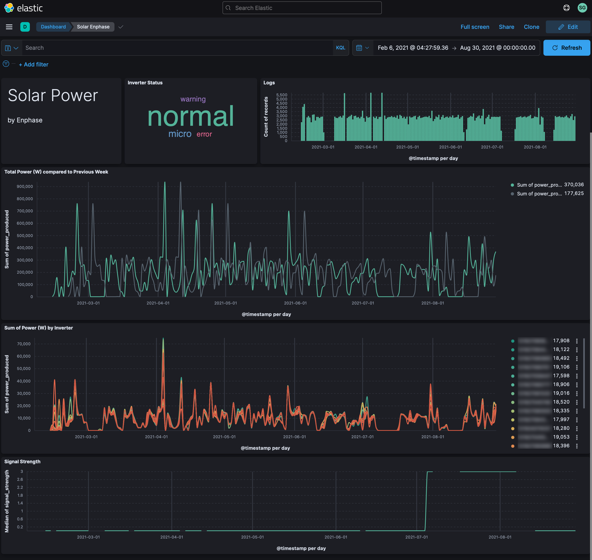
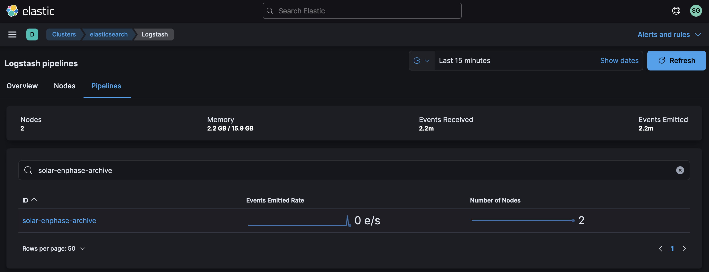
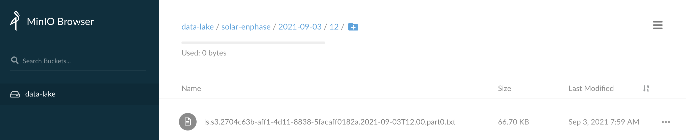
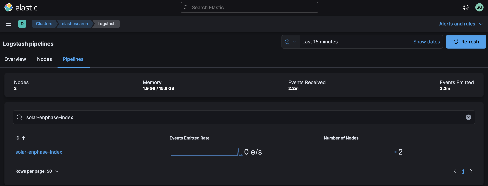

# Solar Monitoring with Enphase


The [IQ 7+](https://store.enphase.com/storefront/en-us/iq-7plus-microinverter) from Enphase is a microinverter compatible with 60 and 72-cell solar panels that can produce 295VA at peak power.  Enphase provides an [API]( https://developer.enphase.com/docs#envoys) that allows us to query a set of these microinverters reporting into their service.  They offer a range of [Plans](https://developer.enphase.com/plans), including a free plan, which we'll be using for this data source.

For this data source, we'll build the following dashboard with Elastic:



Let's get started!

## Step #1 - Collect Data

Create a new python script called `~/bin/solar-enphase.py` with the following contents:

​	[solar-enphase.py](solar-enphase.py)

The script queries a set of Enphase's APIs at different intervals.  The goal being to stay within our alotted quota of 10k API calls per month.  We'll write the data collected to our data lake, but only use a portion of it for analysis in Elastic.

Take a few minutes to familiarize yourself with the script.  There are a couple of labels you can change near the bottom.  Adjust the values of `<your_site_id>`, `<your_key>` and `<your_user_id>` to suit your needs.  The Enphase [Developer Portal](https://developer.enphase.com) is where you can get these values.

When you're ready, try running the script:

```bash
chmod a+x ~/bin/solar-enphase.py
~/bin/solar-enphase.py
```

You may not see any output, and this is by design (not a great design, albeit, but it works for now).  Since we're limited to ~300 API calls per day on the Free plan, the script checks to see if it's on a specific minute of the hour in order to determine which API calls to make.

If you run the script at :00, :10, :20, :30, :40, or :50 past the hour, you should see output on `stdout` similar to:

```json
[{"signal_strength":0,"micro_inverters":[{"id":40236944,"serial_number":"121927062331","model":"IQ7+","part_number":"800-00625-r02","sku":"IQ7PLUS-72-2-US","status":"normal","power_produced":28,"proc_load":"520-00082-r01-v04.27.04","param_table":"540-00242-r01-v04.22.09","envoy_serial_number":"111943015132",...
```

Once you confirm the script is working, you can redirect its output to a log file:

```bash
sudo touch /var/log/solar-enphase.log
sudo chown ubuntu.ubuntu /var/log/solar-enphase.log
```

Create a logrotate entry so the log file doesn't grow unbounded:

```bash
sudo vi /etc/logrotate.d/solar-enphase
```

Add the following logrotate content:

```
/var/log/solar-enphase.log {
  weekly
  rotate 12
  compress
  delaycompress
  missingok
  notifempty
  create 644 ubuntu ubuntu
}
```

Add the following entry to your crontab with `crontab -e`:

```
* * * * * /home/ubuntu/bin/solar-enphase.py >> /var/log/solar-enphase.log 2>&1
```

Verify output by tailing the log file for a few minutes (since cron is only running the script at the start of each minute):

```bash
tail -f /var/log/solar-enphase.log
```

If you're seeing output scroll every 10 minutes, then you are successfully collecting data!

## Step #2 - Archive Data

Once your data is ready to archive, we'll use Filebeat to send it to Logstash which will in turn sends it to S3.

Add the following to the Filebeat config `/etc/filebeat/filebeat.yml` on the host logging your CO2 data:

```yaml
filebeat.inputs:
  - type: log
    enabled: true
    tags: ["solar-enphase"]
    paths:
      - /var/log/solar-enphase.log
```

This tells Filebeat where the log file is located and it adds a tag to each event.  We'll refer to that tag in Logstash so we can easily isolate events from this data stream.

Restart Filebeat:

```bash
sudo systemctl restart filebeat
```

You may want to tail syslog to see if Filebeat restarts without any issues:

```bash
tail -f /var/log/syslog | grep filebeat
```

At this point, we should have Solar Enphase data flowing into Logstash.  By default however, our `distributor` pipeline in Logstash will put any unrecognized data in our Data Lake / S3 bucket called `NEEDS_CLASSIFIED`.  To change this, we're going to update the `distributor` pipeline to recognize the Solar Enphase data feed.

Add the following conditional to your `distributor.yml` file:

```
} else if "solar-enphase" in [tags] {
    pipeline {
        send_to => ["solar-enphase-archive"]
    }
}
```

Create a Logstash pipeline called `solar-enphase-archive.yml` with the following contents:

```
input {
    pipeline {
        address => "solar-enphase-archive"
    }
}
filter {
}
output {
    s3 {
        #
        # Custom Settings
        #
        prefix => "solar-enphase/%{+YYYY}-%{+MM}-%{+dd}/%{+HH}"
        temporary_directory => "${S3_TEMP_DIR}/solar-enphase-archive"
        access_key_id => "${S3_ACCESS_KEY}"
        secret_access_key => "${S3_SECRET_KEY}"
        endpoint => "${S3_ENDPOINT}"
        bucket => "${S3_BUCKET}"

        #
        # Standard Settings
        #
        validate_credentials_on_root_bucket => false
        codec => json_lines
        # Limit Data Lake file sizes to 5 GB
        size_file => 5000000000
        time_file => 60
        # encoding => "gzip"
        additional_settings => {
            force_path_style => true
            follow_redirects => false
        }
    }
}
```

Put this pipeline in your Logstash configuration directory so it gets loaded whenever Logstash restarts:

```bash
sudo mv solar-enphase-archive.yml /etc/logstash/conf.d/
```

Add the pipeline to your `/etc/logstash/pipelines.yml` file:

```
- pipeline.id: "solar-enphase-archive"
  path.config: "/etc/logstash/conf.d/solar-enphase-archive.conf"
```

And finally, restart the Logstash service:

```bash
sudo systemctl restart logstash
```

While Logstash is restarting, you can tail it's log file in order to see if there are any configuration errors:

```bash
sudo tail -f /var/log/logstash/logstash-plain.log
```

After a few seconds, you should see Logstash shutdown and start with the new pipeline and no errors being emitted.

Check your cluster's Stack Monitoring to see if we're getting events through the pipeline:



Check your S3 bucket to see if you're getting data directories created for the current date & hour with data:



If you see your data being stored, then you are successfully archiving!

## Step #3 - Index Data

Once Logstash is archiving the data, next we need to index it with Elastic.

We'll use Elastic's [Dynamic field mapping](https://www.elastic.co/guide/en/elasticsearch/reference/current/dynamic-field-mapping.html) feature to automatically create the right [Field data types](https://www.elastic.co/guide/en/elasticsearch/reference/current/mapping-types.html) for the data we're sending in.  

Using the [Logstash Toolkit](http://github.com/gose/logstash-toolkit), the following filter chain has been built that can parse the raw JSON coming in.

Create a new pipeline called `solar-enphase-index.yml` with the following content:

```
input {
  pipeline {
    address => "solar-enphase-index"
  }
}
filter {
  json {
    source => "message"
  }
  if [message] =~ /^\[/ {
    json {
      source => "message"
      target => "tmp"
    }
  } else {
    drop { }
  }
  if "_jsonparsefailure" in [tags] {
    drop { }
  }
  mutate {
    remove_field => ["message"]
  }
  mutate {
    add_field => {
      "message" => "%{[tmp][0]}"
    }
  }
  mutate {
    remove_field => ["tmp"]
  }
  json {
    source => "message"
  }
  mutate {
    remove_field => ["message"]
  }
  split {
    field => "micro_inverters"
  }
  ruby {
    # Promote the keys inside tmp to root, then remove tmp
    code => '
      event.get("micro_inverters").each { |k, v|
        event.set(k,v)
      }
      event.remove("micro_inverters")
    '
  }
  date {
    match => ["last_report_date", "ISO8601"]
  }
  mutate {
    remove_field => ["last_report_date", "part_number", "envoy_serial_number", "param_table"]
    remove_field => ["model", "sku", "grid_profile", "proc_load", "id"]
    remove_field => ["agent", "host", "input", "log", "host", "ecs", "@version"]
  }
}
output {
  elasticsearch {
      #
      # Custom Settings
      #
      id => "solar-enphase-index"
      index => "solar-enphase-%{+YYYY.MM.dd}"
      hosts => "${ES_ENDPOINT}"
      user => "${ES_USERNAME}"
      password => "${ES_PASSWORD}"
  }
}
```

Put this pipeline in your Logstash configuration directory so it gets loaded in whenever Logstash restarts:

```bash
sudo mv solar-enphase-index.yml /etc/logstash/conf.d/
```

Add the pipeline to your `/etc/logstash/pipelines.yml` file:

```
- pipeline.id: "solar-enphase-index"
  path.config: "/etc/logstash/conf.d/solar-enphase-index.conf"
```

And finally, restart the Logstash service:

```bash
sudo systemctl restart logstash
```

While Logstash is restarting, you can tail it's log file in order to see if there are any configuration errors:

```bash
sudo tail -f /var/log/logstash/logstash-plain.log
```

After a few seconds, you should see Logstash shutdown and start with the new pipeline and no errors being emitted.

Check your cluster's Stack Monitoring to see if we're getting events through the pipeline:



## Step #4 - Visualize Data

Once Elasticsearch is indexing the data, we want to visualize it in Kibana.

Download this dashboard:  [solar-enphase.ndjson](solar-enphase.ndjson)

Jump back into Kibana:

1. Select "Stack Management" from the menu
2. Select "Saved Objects"
3. Click "Import" in the upper right

Once it's been imported, click on "Solar Enphase".


Congratulations!  You should now be looking at data from your Solar Enphase in Elastic.
