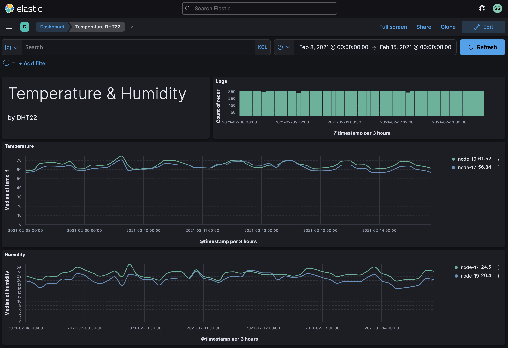
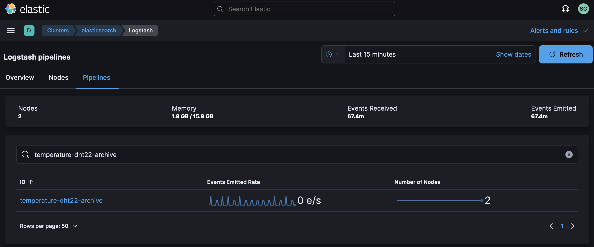
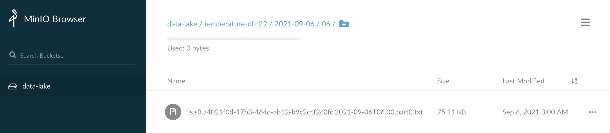
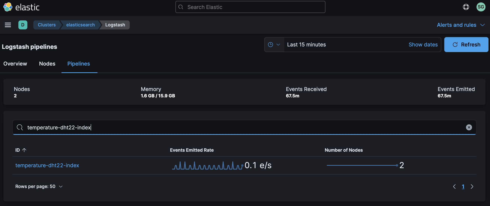

# Monitoring Temperature with DHT22


The [DHT22](http://www.adafruit.com/products/385), in a low-cost digital temperature and humidity sensor.  It uses a capacitive humidity sensor and a thermistor to measure the surrounding air, and outputs a digital signal on the data pin reporting their values.  The [AM2302](https://www.adafruit.com/product/393) is a wired version of this sensor which includes the required [4.7K - 10KΩ](https://raspberrypi.stackexchange.com/questions/12161/do-i-have-to-connect-a-resistor-to-my-dht22-humidity-sensor) resistor.  The version by [FTCBlock](https://www.amazon.com/FTCBlock-Temperature-Humidity-Electronic-Practice/dp/B07H2RP26F) comes with GPIO jumpers that don't require a breadboard or soldering.

We'll use a Python script to query the sensor each minute via a cron job, and redirect the output to a log file.  From there, Filebeat will pick it up and send it to Elastic.



Let's get started.

## Step #1 - Collect Data

Install the following Python module:

```bash
sudo pip3 install Adafruit_DHT
```

Create a Python script at `~/bin/temperature-dht22.py` with the following contents (adjusting any values as you see fit):

```python
#!/usr/bin/env python3
  
import Adafruit_DHT
import datetime
import json
import socket

DHT_SENSOR = Adafruit_DHT.DHT22
DHT_PIN = 4

if __name__ == "__main__":
    humidity, temp_c = Adafruit_DHT.read_retry(DHT_SENSOR, DHT_PIN)
    temp_f = (temp_c * 9 / 5) + 32
    output = {
        "timestamp":  datetime.datetime.utcnow().isoformat(),
        "host": socket.gethostname(),
        "temp_c": float("%2.2f" % temp_c),
        "temp_f": float("%2.2f" % temp_f),
        "humidity": float("%2.2f" % humidity),
        "location": "office",
        "source": "DHT22"
    }
    print(json.dumps(output))
```

Try running the script from the command line:

```bash
chmod a+x ~/bin/temperature-dht22.py
sudo ~/bin/temperature-dht22.py
```

The output should look like the following:

```json
{"timestamp": "2021-09-05T12:30:10.436436", "host": "node-19", "temp_c": 21.3, "temp_f": 70.34, "humidity": 60.2, "location": "office", "source": "DHT22"}
```

Once you're able to successfully query the sensor, create a log file for its output:

```bash
sudo touch /var/log/temperature-dht22.log
sudo chown ubuntu.ubuntu /var/log/temperature-dht22.log
```

Create a logrotate entry so the log file doesn't grow unbounded:

```
sudo vi /etc/logrotate.d/temperature-dht22
```

Add the following content:

```
/var/log/temperature-dht22.log {
  weekly
  rotate 12
  compress
  delaycompress
  missingok
  notifempty
  create 644 ubuntu ubuntu
}
```

Add the following entry to your crontab:

```
* * * * * sudo /home/ubuntu/bin/temperature-dht22.py >> /var/log/temperature-dht22.log 2>&1
```

Verify output by tailing the log file for a few minutes:

```
$ tail -f /var/log/temperature-dht22.log
```

If you're seeing output scroll each minute then you are successfully collecting data!

## Step #2 - Archive Data

Once your data is ready to archive, we'll use Filebeat to send it to Logstash which will in turn sends it to S3.

Add the following to the Filebeat config `/etc/filebeat/filebeat.yml` on the host logging your DHT22 data:

```yaml
filebeat.inputs:
  - type: log
    enabled: true
    tags: ["temperature-dht22"]
    paths:
      - /var/log/temperature-dht22.log
```

This tells Filebeat where the log file is located and it adds a tag to each event.  We'll refer to that tag in Logstash so we can easily isolate events from this data stream.

Restart Filebeat:

```bash
sudo systemctl restart filebeat
```

You may want to tail syslog to see if Filebeat restarts without any issues:

```bash
tail -f /var/log/syslog | grep filebeat
```

At this point, we should have DHT22 data flowing into Logstash.  By default however, our `distributor` pipeline in Logstash will put any unrecognized data in our Data Lake / S3 bucket called `NEEDS_CLASSIFIED`.  To change this, we're going to update the `distributor` pipeline to recognize the DHT22 data feed.

Add the following conditional to your `distributor.yml` file:

```
} else if "temperature-dht22" in [tags] {
    pipeline {
        send_to => ["temperature-dht22-archive"]
    }
}
```

Create a Logstash pipeline called `temperature-dht22-archive.yml` with the following contents:

```
input {
    pipeline {
        address => "temperature-dht22-archive"
    }
}
filter {
}
output {
    s3 {
        #
        # Custom Settings
        #
        prefix => "temperature-dht22/%{+YYYY}-%{+MM}-%{+dd}/%{+HH}"
        temporary_directory => "${S3_TEMP_DIR}/temperature-dht22-archive"
        access_key_id => "${S3_ACCESS_KEY}"
        secret_access_key => "${S3_SECRET_KEY}"
        endpoint => "${S3_ENDPOINT}"
        bucket => "${S3_BUCKET}"

        #
        # Standard Settings
        #
        validate_credentials_on_root_bucket => false
        codec => json_lines
        # Limit Data Lake file sizes to 5 GB
        size_file => 5000000000
        time_file => 60
        # encoding => "gzip"
        additional_settings => {
            force_path_style => true
            follow_redirects => false
        }
    }
}
```

Put this pipeline in your Logstash configuration directory so it gets loaded whenever Logstash restarts:

```bash
sudo mv temperature-dht22-archive.yml /etc/logstash/conf.d/
```

Add the pipeline to your `/etc/logstash/pipelines.yml` file:

```
- pipeline.id: "temperature-dht22-archive"
  path.config: "/etc/logstash/conf.d/temperature-dht22-archive.conf"
```

And finally, restart the Logstash service:

```bash
sudo systemctl restart logstash
```

While Logstash is restarting, you can tail it's log file in order to see if there are any configuration errors:

```bash
sudo tail -f /var/log/logstash/logstash-plain.log
```

After a few seconds, you should see Logstash shutdown and start with the new pipeline and no errors being emitted.

Check your cluster's Stack Monitoring to see if we're getting events through the pipeline:



Check your S3 bucket to see if you're getting data directories created for the current date & hour with data:



If you see your data being stored, then you are successfully archiving!

## Step #3 - Index Data

Once Logstash is archiving the data, next we need to index it with Elastic.

We'll use Elastic's [Dynamic field mapping](https://www.elastic.co/guide/en/elasticsearch/reference/current/dynamic-field-mapping.html) feature to automatically create the right [Field data types](https://www.elastic.co/guide/en/elasticsearch/reference/current/mapping-types.html) for the data we're sending in.  

Using the [Logstash Toolkit](http://github.com/gose/logstash-toolkit), the following filter chain has been built that can parse the raw JSON coming in.

Create a new pipeline called `temperature-dht22-index.yml` with the following content:

```
input {
    pipeline {
        address => "temperature-dht22-index"
    }
}
filter {
    json {
        source => "message"
    }
    json {
        source => "message"
    }
    date {
        match => ["timestamp", "ISO8601"]
    }
    mutate {
        remove_field => ["timestamp", "message"]
        remove_field => ["tags", "agent", "input", "log", "path", "ecs", "@version"]
    }
}
output {
    elasticsearch {
        #
        # Custom Settings
        #
        id => "temperature-dht22-index"
        index => "temperature-dht22-%{+YYYY.MM.dd}"
        hosts => "${ES_ENDPOINT}"
        user => "${ES_USERNAME}"
        password => "${ES_PASSWORD}"
    }
}
```

Put this pipeline in your Logstash configuration directory so it gets loaded in whenever Logstash restarts:

```bash
sudo mv temperature-dht22-index.yml /etc/logstash/conf.d/
```

Add the pipeline to your `/etc/logstash/pipelines.yml` file:

```
- pipeline.id: "temperature-dht22-index"
  path.config: "/etc/logstash/conf.d/temperature-dht22-index.conf"
```

Append your new pipeline to your tagged data in the `distributor.yml` pipeline:

```
} else if "temperature-dht22" in [tags] {
    pipeline {
        send_to => ["temperature-dht22-archive", "temperature-dht22-index"]
    }
}
```

And finally, restart the Logstash service:

```bash
sudo systemctl restart logstash
```

While Logstash is restarting, you can tail it's log file in order to see if there are any configuration errors:

```bash
sudo tail -f /var/log/logstash/logstash-plain.log
```

After a few seconds, you should see Logstash shutdown and start with the new pipeline and no errors being emitted.

Check your cluster's Stack Monitoring to see if we're getting events through the pipeline:



## Step #4 - Visualize Data

Once Elasticsearch is indexing the data, we want to visualize it in Kibana.

Download this dashboard:  [temperature-dht22.ndjson](temperature-dht22.ndjson)

Jump back into Kibana:

1. Select "Stack Management" from the menu
2. Select "Saved Objects"
3. Click "Import" in the upper right

Once it's been imported, click on "Temperature DHT22".


Congratulations!  You should now be looking at temperature data from your DHT22 in Elastic.

